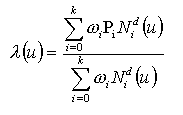

IfcBSplineCurve
===============
The _IfcBSplineCurve_ is a spline curve parameterized by spline functions.  
  
Figure 1 illustrates a B-spline curve.  
  
> NOTE  Figure quoted from ISO 10303-42.  
  
  
  
{ .extDef}  
> NOTE  Definition according to ISO/CD 10303-42:1992  
> A B-spline curve is a piecewise parametric polynomial or rational curve
> described in terms of control points and basis functions. The B-spline curve
> has been selected as the most stable format to represent all types of
> polynomial or rational parametric curves. With appropriate attribute values
> it is capable of representing single span or spline curves of explicit
> polynomial, rational, Bezier or B-spline type.  
>  
> Interpretation of the data is as follows:

  

  1.   

All weights shall be positive and the curve is given by

  
  
  
  
 _k_ +1  
| = number of control points  
  
---|---  
  
  
P _i_  
|  = control points  
  
  
  
 _w_ _i_  
|  = weights  
  
  
  
 _d_  
|  = degree  
  
  
  

The knot array is an array of ( _k_ + _d_ +2) real numbers  
[ _u_ - _d_ ... _u_ _k_ +1], such that for all indices j in  
[- _d_ , _k_ ], _u_ j <= _u_ j+1. This array is obtained from the knot  
data list by repeating each multiple knot according to the multiplicity. _N
di_, the  
 _i_ th normalized B-spline basis function of degree _d_ , is defined on the
subset  
[ _u i-d_, ... , _u i+1_] of this array.

  

  

  2.   

Let _L_ denote the number of distinct values among the _d_ + _k_ +2  
knots in the knot array; _L_ will be referred to as the ''upper index on
knots''. Let _m j_  
denote the multiplicity (number of repetitions) of the _j_ th distinct knot.
Then

  
  

All knot multiplicities except the first and the last shall be in the range 1
...  
degree; the first and last may have a maximum value of degree + 1. In
evaluating the basis functions, a knot _u_  
of e.g. multiplicity 3 is interpreted as a string _u, u, u,_ in the knot
array. The B-spline curve has 3 special  
subtypes ( _Note: only 1, Bezier curve, included in this IFC release_ ) where
the knots and knot multiplicities  
are derived to provide simple default capabilities.

  

  

  3. Logical flag is provided to indicate whether the curve self intersects or not.
  

  
  
> NOTE  Entity adapted from **b_spline_curve** defined in ISO10303-42.  
  
> HISTORY  New entity in IFC2x2.  
[ _bSI
Documentation_](https://standards.buildingsmart.org/IFC/DEV/IFC4_2/FINAL/HTML/schema/ifcgeometryresource/lexical/ifcbsplinecurve.htm)

Attribute definitions
---------------------
| Attribute                 | Description                                                                                                                   |
|---------------------------|-------------------------------------------------------------------------------------------------------------------------------|
| Degree                    | The algebraic degree of the basis functions.                                                                                  |
| CurveForm                 | Used to identify particular types of curve; it is for information only.                                                       |
| ClosedCurve               | Indication of whether the curve is closed; it is for information only.                                                        |
| SelfIntersect             | Indication whether the curve self-intersects or not; it is for information only.                                              |
| UpperIndexOnControlPoints | The upper index on the array of control points; the lower index is 0.\X\0DThis value is derived from the control points list. |
| ControlPoints             | The array of control points used to define the geometry of the curve. This is derived from the list of control points.        |

Formal Propositions
-------------------
| Rule    | Description   |
|---------|---------------|
| SameDim |               |

Associations
------------
| Attribute         | Description   |
|-------------------|---------------|
| ControlPointsList |               |

