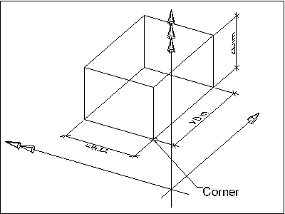

IfcBoundingBox
==============
The _IfcBoundingBox_ defines an orthogonal box oriented parallel to the axes
of the object coordinate system in which it is defined. It is defined by a
_Corner_ being a three-dimensional Cartesian point and three length measures
defining the X, Y and Z parameters of the box in the direction of the positive
axes.  
  
> NOTE  Any subtype of _IfcProduct_ having a product shape representation may
> have a bounding box representation. The ''Box'' representation identifier
> defined at IfcShapeRepresentation utilizes the _IfcBoundingBox_ as the
> simpliest 3D shape representation.  
  
  
  
  
|  

As shown in Figure 1, the _IfcBoundingBox_ is defined with its own location
which can be used to place the  
 _IfcBoundingBox_ relative to the geometric coordinate system. The
_IfcBoundingBox_ is defined by the  
lower left corner ( _Corner_ ) and the upper right corner ( _XDim, YDim, ZDim_
measured within the parent  
co-ordinate system).

  
  
  
---|---  
  
  
  

Figure 1 -- Bounding box

  
  
|  
  
  
  
  
> NOTE  Corresponding STEP type **box_domain** defined in ISO 10303-42.  
  
> HISTORY  New entity in IFC1.0.  
[ _bSI
Documentation_](https://standards.buildingsmart.org/IFC/DEV/IFC4_2/FINAL/HTML/schema/ifcgeometricmodelresource/lexical/ifcboundingbox.htm)

Attribute definitions
---------------------
| Attribute   | Description                                                        |
|-------------|--------------------------------------------------------------------|
| Corner      |                                                                    |
| XDim        | Length attribute (measured along the edge parallel to the X Axis)  |
| YDim        | Width attribute (measured along the edge parallel to the Y Axis)   |
| ZDim        | Height attribute (measured along the edge parallel to the Z Axis). |
| Dim         | The space dimensionality of this class, it is always 3.            |

