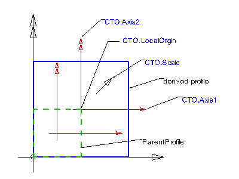
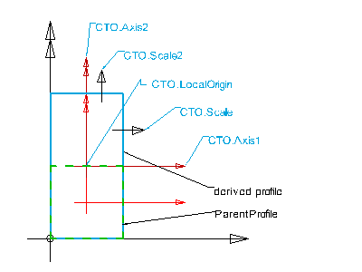
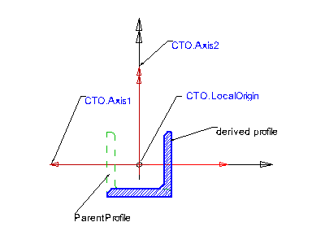

IfcDerivedProfileDef
====================
_IfcDerivedProfileDef_ defines the profile by transformation from the parent
profile. The transformation is given by a two dimensional transformation
operator. Transformation includes translation, rotation, mirror and scaling.
The latter can be uniform or non uniform. The derived profiles may be used to
define swept surfaces, swept area solids or sectioned spines.  
  
The transformation effects the position, rotation, mirroring or scale of the
profile at the underlying coordinate system, i.e. the coordinate system
defined by the swept surface or swept area solid that uses the profile
definition. It is the xy plane of either:  
  
* _IfcSweptSurface.Position_  
* _IfcSweptAreaSolid.Position_  
  
or in case of sectioned spines the xy plane of each list member of
_IfcSectionedSpine.CrossSectionPositions_. The position and potential rotation
of the _ParentProfile_ within the underlying coordinate system is taken into
consideration before applying the Cartesian transformation operator.  
  
Note, if only mirroring is required, _IfcMirroredProfileDef_ should be used
instead.  
  
> HISTORY  New entity in IFC2x.  
  
Figure 1 illustrates examples of derived profiles.  
  
  
  
  
  
  
|  
  
  
  
  
|  
  

_Parameter_  
  
The _IfcDerivedProfileDef_  
is defined using the _IfcCartesianTransformationOperator2D_  
(CTO), which is applied to the parent profile definition.  
  

  
  

_Example_  
  
The example shows an uniform scaling and a transformation  
of an _IfcRectangleProfileDef_  
to match the lower-left cardinal point. The attributes of the CTO are:  
  

  
  

> `Axis1 = NIL (defaults to 1.,0.)  
>  
>  Axis2 = NIL (defaults to 0.,1.)  
>  
>  LocalOrigin = IfcCartesianPoint(<1/2 XDim>,<1/2 YDim>)  
>  
>  Scale = 2.  
>  
>  `

  
  
Note: The _ParentProfile_ has a _Position_  
= _IfcCartesianPoint_ (<1/2 XDim>,<1/2 YDim>) already.  
  
  
  
  
---|---  
  
  
  
  
  
  
  
|  
  

_Parameter_  
  
The _IfcDerivedProfileDef_ is defined using  
non uniform transformationsby applying the
_IfcCartesianTransformationOperator2DnonUniform_  
as a subtype of the 2D CTO.

  
  

 _Example_  
  
The example shows a non-uniform scaling and a translation of an
_IfcRectangleProfileDef_  
to match the lower-left cardinal point. The attributes of the CTO are:

  
  

> `Axis1 = NIL (defaults to 1.,0.)  
>  
>  Axis2 = NIL (defaults to 0.,1.)  
>  
>  LocalOrigin = IfcCartesianPoint(0.,<1/2 YDim)  
>  
>  Scale  = 1.  
>  
>  Scale2 = 2.  
>  
>  `

  
  
Note: The _ParentProfile_ has a _Position_  
= _IfcCartesianPoint_ (<1/2 XDim>,<1/2 YDim>) already.  
  
  
  
  
  
  
  
  
  
  
|  
  

_Parameter_  
  
The _IfcDerivedProfileDef_  
is defined using mirroring by applying the
_IfcCartesianTransformationOperator2D_  
(CTO) to the parent profile.

  
  

 _Example_  
  
The example shows a mirroring of an _IfcLShapeProfileDef_  
to match the centre cardinal point. The attributes of the CTO are:

  
  

> `Axis1 = (-1.,0.)  
>  
>  Axis2 = NIL (defaults to 0.,1.)  
>  
>  LocalOrigin = IfcCartesianPoint(0.,0.)  
>  
>  Scale = NIL (defaults to 1.)  
>  
>  `

  
  
Note: The _ParentProfile_ has a _Position_ = _IfcCartesianPoint_ (0.,0.).  
  

This example is for illustration only.  
If the transformation results only in mirroring like shown in the example,
then  
 _IfcMirroredProfileDef_ should be used instead of _IfcDerivedProfileDef_.

  
  
  
  
  
  
  
  
Note: The following color map applies:  
  
  

  

  * black coordinate axes show the  
\X\09\X\09underlying coordinate system of the swept surface, swept area solid,
or  
\X\09\X\09sectioned spine

  
  

  * red coordinate axes  
\X\09\X\09show the position coordinate system of the parent profile

  
  

  * brown coordinate axes  
\X\09\X\09show the position coordinate system of the derived profile

  

  
  
  
  
  
  
  
  
  

Figure 1 -- Derived profile  
  
  
  
[ _bSI
Documentation_](https://standards.buildingsmart.org/IFC/DEV/IFC4_2/FINAL/HTML/schema/ifcprofileresource/lexical/ifcderivedprofiledef.htm)

Attribute definitions
---------------------
| Attribute     | Description                                                                                                                               |
|---------------|-------------------------------------------------------------------------------------------------------------------------------------------|
| Operator      |                                                                                                                                           |
| ParentProfile |                                                                                                                                           |
| Label         | The name by which the transformation may be referred to. The actual meaning of the name has to be defined in the context of applications. |

