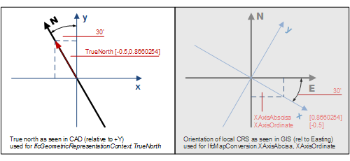

IfcGeometricRepresentationContext
=================================
The _IfcGeometricRepresentationContext_ defines the context that applies to
several shape representations of products within a project. It defines the
type of the context in which the shape representation is defined, and the
numeric precision applicable to the geometric representation items defined in
this context. In addition it can be used to offset the project coordinate
system from a global point of origin, using the _WorldCoordinateSystem_
attribute. The main representation context may also provide the true north
direction, see Figure 1.  
  
  
  
  
  
  
|  

  
The _TrueNorth_ attribute should be provided, if the y axis of the
_WorldCoordinateSystem_ does not point to the global northing. Direction of
the true north, or geographic northing direction, relative to the underlying
project coordinate system as established by the attribute
_WorldCoordinateSystem_. It is given by a 2 dimensional direction within the
xy-plane of the project coordinate system. If not resent, it defaults to
[0.,1.] - i.e. the positive Y axis of the project coordinate system equals the
geographic northing direction. The direction is provided within project
coordinate system and identifies the true north direction.

  

>  
>  The "true North as seen in CAD" within the figure on the left shows the
> correct interpretation of the _TrueNorth_ direction  
>

  

  
If a conversion to a geographic coordinate system is included by virtue of the
_HasCoordinateOperation_ attribute, then the _TrueNorth_ attribute shall be
omitted or included only for informational purposes. It shall not be added to
any transformation already applied by an _IfcCoordinateOperation_.

  
  
  
---|---  
  
  

Figure 1 -- Definition of the true north direction

  
  
|  
  
  
  
  
The use of one instance of _IfcGeometricRepresentationContext_ to represent
the model (3D) view is mandatory, the use of a second instance of
_IfcGeometricRepresentationContext_ to represent the plan (2D) view is
optional (but needs to be given, if there are scale dependent plan views), the
additional scale or view dependent contexts need to be handled by using the
subtype _IfcGeometricRepresentationSubContext_ pointing to the model view (or
the plan view) as the _ParentContext_. See Figure 2 for an example using
geometric representation contexts for 3D and 2D with assigned sub contexts.  
  
> NOTE  The inherited attribute _ContextType_ shall have one of the following
> recognized values: ''Model'', ''Plan'', ''NotDefined''.  
  
  
  
  
  
  
  
  
|  

Use of representation contexts defined at _IfcProject_ for 3D model and 2D
plan context,  
including sub context definitions for different target scales. There shall
always be a maximum of one geometric representation context for 2D and for 3D
coordinate space.

  
  
  
---|---  
  
  

Figure 2 -- Example of using geometric representation contexts

  
  
|  
  
  
  
  
{ .extDef}  
> NOTE  Definition according to ISO/CD 10303-42:1992  
> A geometric representation context is a representation context in which the
> geometric representation items are geometrically founded.  
  
> NOTE  Entity adapted from **geometric_representation_context** defined in
> ISO 10303-42.  
  
> HISTORY  New entity in IFC2.0.  
  
{ .change-ifc2x3}  
> IFC2x3 CHANGE  Applicable values for _ContextType_ are only ''Model'',
> ''Plan'', and ''NotDefined''. All other contexts are now handled by
> _IfcGeometricRepresentationSubContext_.  
  
{ .change-ifc2x4}  
> IFC4 CHANGE  Mapping to Geographic coordinate system added by inverse
> attribute _HasCoordinateOperation_.  
[ _bSI
Documentation_](https://standards.buildingsmart.org/IFC/DEV/IFC4_2/FINAL/HTML/schema/ifcrepresentationresource/lexical/ifcgeometricrepresentationcontext.htm)

