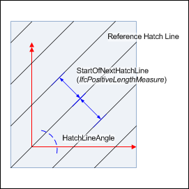
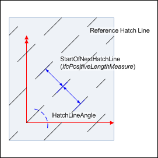
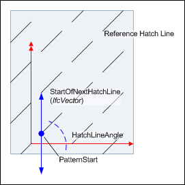
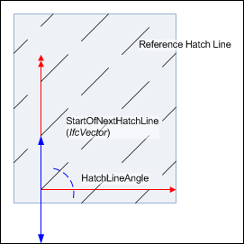
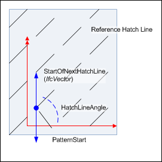
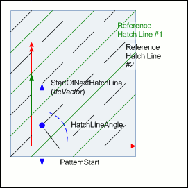

IfcFillAreaStyleHatching
========================
The _IfcFillAreaStyleHatching_ is used to define simple, vector-based hatching
patterns, based on styled straight lines. The curve font, color and thickness
is given by the _HatchLineAppearance_, the angle by the _HatchLineAngle_ and
the distance to the next hatch line by _StartOfNextHatchLine_, being either an
offset distance or a vector.  
  
{ .extDef}  
> NOTE  Definition according to ISO 10303-46:  
> The fill area style hatching defines a styled pattern of curves for hatching
> an annotation fill area or a surface.  
  
> NOTE  If the hatch pattern involves two (potentially crossing) rows of hatch
> lines, then two instances of _IfcFillAreaStyleHatching_ should be assigned
> to the _IfcFillAreaStyle_. Both share the same (virtual) point of origin of
> the hatching that is used by the reference hatch line (or the
> _PointOfReferenceHatchLine_ if there is an offset).  
  
For better control of the hatching appearance, when using hatch lines with
other fonts then continuous, the _PatternStart_ allows to offset the start of
the curve font pattern along the reference hatch line (if not given, the
_PatternStart_ is at zero distance from the virtual point of origin). If the
reference hatch line does not go through the origin (of the virtual hatching
coordinate system), it can be offset by using the _PatternStart_ .  
  
> NOTE  The coordinates of the _PatternStart_ are given relative to the origin
> of the object coordinate of _IfcAnnotationFillArea_, or if present, the
> _FillAreaTarget_ attribute of _IfcAnnotationFillArea_. The measure values
> are given in global drawing length units, representing a model hatching, and
> can be translated into drawing units by the _TargetScale_ for a scale
> depended _IfcGeometricRepresentationSubcontext_, if provided.  
  
{ .deprecated}  
> DEPRECATION  The use of _PointOfReferenceHatchLine_ is deprecated.  
  
Figure 1 illustrates hatch attributes.  
  
  
  
  
  
  
  
|   
|  _Example 1_  
  
This example shows simple hatching given by using a curve font "continuous" at
_HatchLineAppearance_.  
  
  
  
The distance of hatch lines is given by a positive length measure. The angle
(here 45'' if measures in degree) is provided by _HatchLineAngle_.  
  
  
  
The _PatternStart_ is set to NIL ($) in this example.  
|    
| _Example 2_  
  
This shows hatching from example 1 with using a different curve font at
_HatchLineAppearance_.  
  
  
The distance of hatch lines is given by a positive length  
measure, therefore the font pattern start is at a point at the next hatch line  
given by a vector being perpendicular to the point of origin at the reference  
hatch line.  
  
  
The _PatternStart_ is set to NIL ($) in this  
example.  
  
---|---|---|---  
  
  
  
|  _Example 3_  
  
This example uses hatching from example 2 with a vector to determine the
pattern start of the next hatch lines.  
  
  
  
The pattern start is the beginning of the first visual curve font pattern
segment at _IfcCurveFont.CurveFont_.  
  
  
The _PatternStart_ is set to NIL ($) in this  
example.  
  
|   
|  _Example 4_  
  
This example uses hatching from example 3 where the pattern start is offset  
from the point of origin at the reference hatch line. That is, the first  
visible curve font pattern segment now does not start at the point of origin
at  
the reference hatch line.  
  
  
  
  
  
  
  
|  _Example 5_  
  
This example uses hatching from example 4 where the hatch pattern is shifted  
against the underlying coordinate system.  
  
  
  
The point that is mapped to the insertion point of the  
 _IfcAnnotationFillAreaOccurrence_ now has an X and Y offset from the  
start of the reference hatch line. That is, the reference hatch line now does  
not go through the insertion point of the hatching.  
  
  
  
  
  
  
  
|   
|  _Example 6_  
  
This example shows use of _IfcFillAreaStyleHatching_ attributes for two
_IfcFillAreaStyleHatching_ ''s within one _IfcFillAreaStyle_.  
  
  
  
Note that the _PatternStart_ now displaces both the reference hatch line from
the point of origin and the start of the curve pattern. This can be used  
in cases when more than one _IfcFillAreaStyleHatching_ is used in an
_IfcFillAreaStyle_ in order to place rows of hatch lines with an offset  
from each other.  
  
  
  
  
  
  
  
  
  

Figure 1 -- Fill area style hatching

  
  
  
  
  
  
> NOTE  Entity adapted from **fill_area_style_hatching** defined in
> ISO10303-46  
  
> HISTORY  New entity in IFC2x2.  
  
{ .change-ifc2x3}  
> IFC2x3 CHANGE  The _IfcFillAreaStyleHatching_ has been changed by making the
> attributes _PatternStart_ and _PointOfReferenceHatchLine_ OPTIONAL. The
> attribute _StartOfNextHatchLine_ has changed to a SELECT with the additional
> choice of _IfcPositiveLengthMeasure_. Upward compatibility for file based
> exchange is guaranteed.  
  
{ .change-ifc2x4}  
> IFC4 CHANGE  The attribute data type for _StartOfNextHatchLine_ has been
> changed to be a select of _IfcPositiveLengthMeasure_ and _IfcVector_.  
[ _bSI
Documentation_](https://standards.buildingsmart.org/IFC/DEV/IFC4_2/FINAL/HTML/schema/ifcpresentationappearanceresource/lexical/ifcfillareastylehatching.htm)

