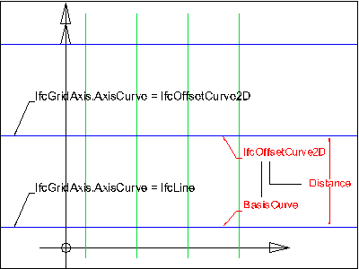

IfcGridAxis
===========
An individual axis, _IfcGridAxis_, is defined in the context of a design grid.
The axis definition is based on a curve of dimensionality 2. The grid axis is
positioned within the XY plane of the position coordinate system defined by
the _IfcGrid_.  
  
The standard geometric representation of _IfcGridAxis_ is defined using a 2D
curve entity. Grid axes are normally defined by an offset to another axis. The
_IfcOffsetCurve2D_ supports this concept. Each grid axis has a sense given by
the parameterization of the curve. The attribute _SameSense_ is an indicator
of whether or not the sense of the grid axis agrees with, or opposes, that of
the underlying curve.  
  
  
  
  
|  

As shown in Figure 1, the grid axis is defined as a 2D curve within  
the xy plane of the position coordinate system. Any curve can be  
used to define a grid axis, most common is the use of IfcLine for  
linear grids and _IfcCircle_ for radial grids.

  

Most grids are defined by a pair of axis  
lists, each defined by a base grid axis and axes given by an  
offset to the base axis. The use of _IfcOffsetCurve2D_ as  
underlying AxisCurve supports this concept.

  
  
  
---|---  
  

Figure 1 -- Grid axis

  
|  
  
  
  
  
> HISTORY  New entity in IFC1.0  
[ _bSI
Documentation_](https://standards.buildingsmart.org/IFC/DEV/IFC4_2/FINAL/HTML/schema/ifcgeometricconstraintresource/lexical/ifcgridaxis.htm)

