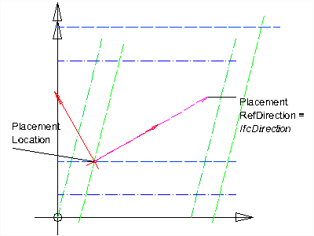

IfcGridPlacement
================
_IfcGridPlacement_ provides a specialization of _IfcObjectPlacement_ in which
the placement and axis direction of the object coordinate system is defined by
a reference to the design grid as defined in _IfcGrid_.  
  
The location of the object coordinate system is given by the attribute
_PlacementLocation_. It is defined as an _IfcVirtualGridIntersection_, that
is, an intersection between two grid axes with optional offsets.  
  
The axis direction of the x-axis of the object coordinate system is given
either:  
  
* _PlacementRefDirection_ = NIL: by the tangent of the first grid axis (_PlacementLocation.IntersectingAxes[1]_) at the virtual intersection (maybe using the offset curve, if _PlacementLocation.OffsetDistances_ is given);  
* _PlacementRefDirection_ = _IfcDirection_: by the explicitly provided direction information;  
* _PlacementRefDirection_ = _IfcVirtualGridIntersection_: by the tangent between the virtual grid intersection of _PlacementLocation_ and the virtual grid intersection of _PlacementRefDirection_. Offsets as potentially provided in the _IfcVirtualGridIntersection_''s of _PlacementLocation_ and _PlacementRefDirection_ have to be taken into account.  
  
The direction of the y-axis of the _IfcGridPlacement_ is the orthogonal
complement to the x-axis. The plane defined by the x and y axis shall be co-
planar to the xy plane of the local placement of the _IfcGrid_.  
  
The direction of the z-axis is the orientation of the cross product of the
x-axis and the y-axis, i.e. the z-axis of the _IfcGridPlacement_ shall be co-
linear to the z-axis of the local placement of the _IfcGrid_.  
  
> NOTE  The _IfcGrid_ local placement, that can be provided relative to the
> local placement of another spatial structure element, has to be taken into
> account for calculating the absolute placement of the virtual grid
> intersection.  
  
> NOTE  The _PlacementLocation.OffsetDistances[3]_ and the
> _PlacementRefDirection.OffsetDistances[3]_ shall either not be assigned or
> should have the same z offset value.  
  
The following figures show the usage of placement location and direction for
an _IfcGridPlacement_.  
  
  
  
|  

Figure 1 illustrates the case where _PlacementRefDirection_ is _not_ given -
the object coordinate system is defined by:

  

  

  *  _its location_ : given by the virtual grid intersection of _PlacementLocation_
  

  *  _its x-axis direction_ : given by the tangent of the first intersecting axis in the offset location of the virtual grid intersection
  

  
  
  
---|---  
  

Figure 1 -- Grid placement

  
|  
  
  
  
  
  
  
  
|  

Figure 2 illustrates the case where _PlacementRefDirection_ is given as an
_IfcDirection_ \- the object coordinate system is defined by:  

  

  *  _its location_ : given by the virtual grid intersection of _PlacementLocation_
  

  *  _its x-axis direction_ : given by the _DirectionRatios_ of the _IfcDirection_ , only the ratios for x and y are taken into account,
  

  
  
  
---|---  
  

Figure 2 -- Grid placement with direction

  
|  
  
  
  
  
  
  
|  

Figure 3 illustrates the case where _PlacementRefDirection_ is given as an
_IfcVirtualGridIntersection_ \- the object coordinate system is defined by:  

  

  *  _its location_ : given by the virtual grid intersection of _PlacementLocation_
  

  *  _its x-axis direction_ : given by the tangent of the line between the virtual grid intersection of the _PlacementLocation_ and the virtual grid intersection of the _PlacementRefDirection_.
  

  
  
  
---|---  
  

Figure 3 -- Grid placement with intersection

  
|  
  
  
  
  
> HISTORY \S\ New entity in IFC1.5. The entity name was changed from
> IfcConstrainedPlacement in IFC2x.  
  
{ .change-ifc2x4}  
> IFC4 CHANGE Attribute data type of _PlacementRefDirection_ has been changed
> to _IfcGridPlacementDirectionSelect_.  
[ _bSI
Documentation_](https://standards.buildingsmart.org/IFC/DEV/IFC4_2/FINAL/HTML/schema/ifcgeometricconstraintresource/lexical/ifcgridplacement.htm)

