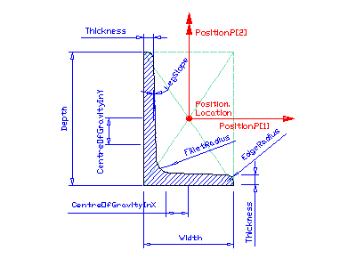
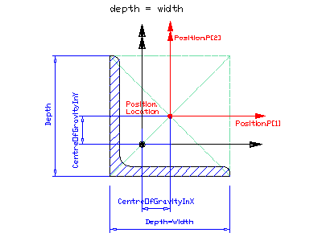

IfcLShapeProfileDef
===================
_IfcLShapeProfileDef_ defines a section profile that provides the defining
parameters of an L-shaped section (equilateral L profiles are also covered by
this entity) to be used by the swept area solid. Its parameters and
orientation relative to the position coordinate system are according to the
following illustration. The shorter leg has the same direction as the positive
_Position.P[1]_-axis, the longer or equal leg the same as the positive
_Position.P[2]_-axis. The centre of the position coordinate system is in the
profiles centre of the bounding box.  
  
> HISTORY  New entity in IFC2x2.  
  
{ .change-ifc2x3}  
> IFC2x3 CHANGE  All profile origins are now in the center of the bounding
> box.  
  
{ .change-ifc2x4}  
> IFC4 CHANGE  Types of _FilletRadius_ and _EdgeRadius_ were relaxed to allow
> for zero values.  
> Trailing attributes _CentreOfGravityInX_ and _CentreOfGravityInY_ deleted,
> use respective properties in _IfcExtendedProfileProperties_ instead.  
> WHERE rule which required _Width_ <= _Depth_ removed.  
  
Figure 1 illustrates parameters of equal-sided and non-equal sided L-shaped
section definitions.  
  
  
  
  
  
  
|  
  
  
  
  
|  
  

_Position_  
  
The parameterized profile defines its own position coordinate system.  
The underlying coordinate system is defined by the swept area solid  
that uses the profile definition. It is the xy plane of:

  

  

  * _IfcSweptAreaSolid.Position_
  

  

by using offsets of the position location, the parameterized profile  
can be positioned centric (using x,y offsets = 0.), or at any position  
relative to the profile.

  
  

In the illustrated example, the ''CentreOfGravityInX'' and
''CentreOfGravityInY'' properties in _IfcExtendedProfileProperties_ , if
provided, are both negative.

  
  
  
  
---|---  
  
  
  
  
  
  
  
Note:  
The black coordinate axes show the  
underlying coordinate system of the swept surface or swept area solid  
  
  
|  
  

_Position_  
  
The profile is inserted into the underlying  
coordinate system of the swept area solid by using the _Position_  
attribute. In this example (cardinal point of gravity) the  
attribute values of _IfcAxis2Placement2D_  
are:

  
  

>  
>
>
> `Location = IfcCartesianPoint(  
>  
>               +|CentreOfGravityInX|,  
>  
>               +|CentreOfGravityInY|)  
>  
> RefDirection = NIL (defaults to 1.,0.)`
>
>  
>

  
  

In the illustrated example, the x and y value of _Position.Location_ , i.e.
the _measures_ |CentreOfGravityInX| and |CentreOfGravityInY| are both
positive. On the other hand, the _properties_ named ''CentreOfGravityInX'' and
''CentreOfGravityInY'' in _IfcExtendedProfileProperties_ , if provided, must
both be set to 0 now because the centre of gravity of the resulting profile
definition is located in the coordinate origin.

  
  
  
  
  
  
  
  
  

Figure 1 -- L-shape profile  
  
  
  
[ _bSI
Documentation_](https://standards.buildingsmart.org/IFC/DEV/IFC4_2/FINAL/HTML/schema/ifcprofileresource/lexical/ifclshapeprofiledef.htm)

