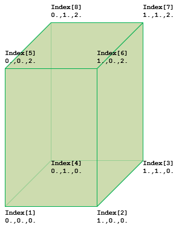

IfcPolygonalFaceSet
===================
The _IfcPolygonalFaceSet_ is a tessellated face set with all faces being bound
by polygons. The planar faces are constructed by implicit polylines defined by
three or more Cartesian points. Each planar face is defined by an instance of
_IfcIndexedPolygonalFace_, or in case of faces with inner loops by
_IfcIndexedPolygonalFaceWithVoids_.  
  
Depending on the value of the attribute _Closed_ the instance of
_IfcPolygonalFaceSet_ represents:  
  
* if TRUE, a boundary represention (or B-rep);  
* if FALSE, a face based surface representation.  
  
  
  
The attribute _Faces_ refers to a list of _IfcIndexedPolygonalFace_''s having
an one-based _CoordIndex_ that provides three or more indices. If the face has
inner loops, the _IfcIndexedPolygonalFaceWithVoids_ has a two-dimensional,
one-based list, where:* the first dimension of the two-dimensional list
addresses the list of inner loops;  
* the second dimension of the two-dimensional list provides three or more indices each being a vertex of the planar polygon representing the inner loop.  
  
Depending on the provision of _PnIndex_ the indices point either directly into
the _IfcCartesianPointList3D_ referenced by _Coordinates_ defined at the
supertype _IfcTessellatedFaceSet_, or they point into the _PnIndex_ where the
integer values at that position provides the location of the coordinate values
within the _IfcCartesianPointList3D_. See Figure 1 for the handling of point
index.  
  
  
  
> NOTE  If the _IfcPolygonalFaceSet_ is closed, the face vertices of the
> _IfcIndexedPolygonalFace_''s shall connect counterclock-wise when seen from
> the outside of the closed shell to guarantee that the face normal points
> away from the material of the shell. Inner loops, provided by the
> _IfcIndexedPolygonalFaceWithVoids_, shall connect clock-wise.  
  
  
  
  
  
  
|  

Figure 2 shows an _IfcFacetedFaceSet_ represented by  
  

  
`  
#1 _IfcIndexedPolygonalFace_ : ((1, 2, 3, 4)  
#2 _IfcIndexedPolygonalFace_ : ((6, 2, 3, 7)  
#3 _IfcIndexedPolygonalFace_ : ((7, 3, 4, 8)  
#4 _IfcIndexedPolygonalFace_ : ((8, 4, 1, 5)  
#5 _IfcIndexedPolygonalFace_ : ((1, 4, 3, 2)  
#6 _IfcIndexedPolygonalFace_ : ((6, 7, 8, 5)  
#7 _IfcCartesianPointList3D_ : ((0.,0.,0.), (1.,0.,0.), (1.,1.,0.),
(0.,1.,0.), (0.,0.,2.), (1.,0.,2.), (1.,1.,2.), (0.,1.,2.))  
`  
  
  
---|---  
  
  

Figure 2 -- Polygonal face set geometry

  
|  
  
  
  
  
> NOTE  The definition of _IfcFacetedFaceSet_ is based on the
> **indexedFaceSet** defined in ISO/IEC 19775-1  
  
> HISTORY  New entity in IFC4 Addendum 2.  
  
{ .spec-head}  
Informal Propositions:  
  
1\. If _Closed_ = TRUE, the same topological constraints as imposed by an
faceted boundary representation shall be safisfied. In particular:  
* each face shall be unique;  
* each edge shall be used by exactly two outer or inner boundaries of faces;  
* the topological normal at each point on the boundary of the polygonal face set shall point away from the material of the solid.  
[ _bSI
Documentation_](https://standards.buildingsmart.org/IFC/DEV/IFC4_2/FINAL/HTML/schema/ifcgeometricmodelresource/lexical/ifcpolygonalfaceset.htm)

