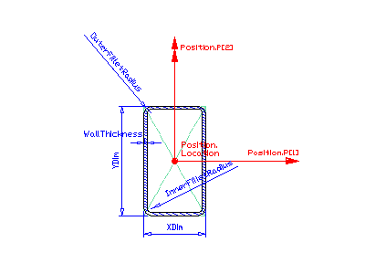

IfcRectangleHollowProfileDef
============================
_IfcRectangleHollowProfileDef_ defines a section profile that provides the
defining parameters of a rectangular (or square) hollow section to be used by
the swept surface geometry or the swept area solid. Its parameters and
orientation relative to the position coordinate system are according to the
following illustration. A square hollow section can be defined by equal values
for h and b. The centre of the position coordinate system is in the profiles
centre of the bounding box (for symmetric profiles identical with the centre
of gravity). Normally, the longer sides are parallel to the y-axis, the
shorter sides parallel to the x-axis.  
  
> HISTORY  New entity in IFC2x2.  
  
{ .change-ifc2x4}  
> IFC4 CHANGE  Types of _InnerFilletRadius_ and _OuterFilletRadius_ relaxed to
> allow for zero values.  
  
Figure 1 illustrates parameters of a rectangular or square hollow profile
definition.  
  
  
  
  
  
|  
  
  
  
  
|  
  

_Position_  
  
The parameterized profile defines its own position coordinate system.  
The underlying coordinate system is defined by the swept area solid  
that uses the profile definition. It is the xy plane of:

  

  

  * IfcSweptAreaSolid.Position
  

  

by using offsets of the position location, the parameterized profile  
can be positioned centric (using x,y offsets = 0.), or at any position  
relative to the profile.

  
  
  
  
---|---  
  
  
  
  
  

Figure 1 -- Rectangle hollow profile  
  
  
  
[ _bSI
Documentation_](https://standards.buildingsmart.org/IFC/DEV/IFC4_2/FINAL/HTML/schema/ifcprofileresource/lexical/ifcrectanglehollowprofiledef.htm)

