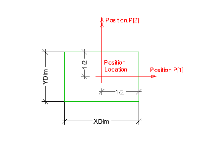

IfcRectangleProfileDef
======================
_IfcRectangleProfileDef_ defines a rectangle as the profile definition used by
the swept surface geometry or the swept area solid. It is given by its X
extent and its Y extent, and placed within the 2D position coordinate system,
established by the _Position_ attribute. It is placed centric within the
position coordinate system.  
  
> HISTORY  New entity in IFC1.5.  
  
Figure 1 illustrates parameters of the rectangle profile definition.  
  
  
  
  
  
|   
|  

_Position_  
  
  
The parameterized profile defines its own position coordinate system.  
The underlying  
coordinate system is defined by the swept surface or swept area solid  
that uses the profile definition. It is the xy plane of either:

  

  

  * IfcSweptSurface.Position
  

  * IfcSweptAreaSolid.Position
  

  
or in case of sectioned spines the xy plane of each list member of
IfcSectionedSpine.CrossSectionPositions.  
  
  
  
  
By using offsets of the position location, the parameterized profile  
can be positioned centric (using x,y offsets = 0.), or at any position  
relative to the profile. Explicit coordinate offsets are used to define  
cardinal points (for example, upper-left bound).  

_Parameter_  
  
  
The _IfcRectangleProfileDef_  
is defined within the position  
coordinate system, where the _XDim_  
defines the length measure  
for the length of the rectangle (half along the positive x-axis) and  
the _YDim_  
defines the length measure for the width of the  
rectangle (half along the positive y-axis).

  
  
  
---|---  
  
  
  
  
  

Figure 1 -- Rectangle profile  
  
  
  
[ _bSI
Documentation_](https://standards.buildingsmart.org/IFC/DEV/IFC4_2/FINAL/HTML/schema/ifcprofileresource/lexical/ifcrectangleprofiledef.htm)

