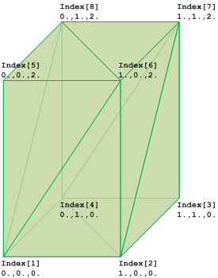

IfcTriangulatedFaceSet
======================
The _IfcTriangulatedFaceSet_ is a tessellated face set with all faces being
bound by triangles. The faces are constructed by implicit polylines defined by
three Cartesian points. Depending on the value of the attribute _Closed_ the
instance of _IfcTriangulatedFaceSet_ represents:  
  
* if TRUE, a boundary represention (or B-rep);  
* if FALSE, a face based surface representation.  
  
The coordinates of each point are provided by a one-based index into an
ordered list of Cartesian points provided by the two-dimensional list
_CoordIndex_, where  
  
* the first dimension of the two-dimensional list addresses the list of triangular faces;  
* the second dimension of the two-dimensional list provides exactly three indices. Each index points to a Cartesian point being a vertex of the triangle.  
  
Depending on the provision of _PnIndex_ the indices point either directly into
the _IfcCartesianPointList3D_ referenced by _Coordinates_ defined at the
supertype _IfcTessellatedFaceSet_, or they point into the _PnIndex_ where the
integer values at that position provides the location of the coordinate values
within the _IfcCartesianPointList3D_. See Figure 1 for the handling of point
index.  
  
  
  
See Figure 2 for using the _IfcTriangulatedFaceSet_ without (as default) and
with using the _PnIndex_.  
  
  
  
Optionally normals can be provided. Only normals per vector are supported
allowing for visually curved triangles when the three normals of the
corresponding three vertices of a triangle are not co-linear to the normal of
the triangular face. If they are identical, normals shall be omited.  
  
> NOTE  In case of a body representation having triangular faces with
> curvature, different normals for all three vertices in context of this
> triangles are exported, describing the curvature for smooth visualisation.
> In case of triangular faces with no curvature, the three vertex-based
> normals are identical and could always be computed from the face. Therefore
> vertices should only be exported to support smooth visualisation by
> curvature of triangles. In case of faceted representation no vertices should
> be exported.  
  
Normals are provided by the two-dimensional list _Normals_, where  
  
* the first dimension of the two-dimensional list addresses the corresponding list of vertex indices of the triangular faces;   
* the second dimension of the two-dimensional list provides exactly three real values to determine the direction of the normal at this vertex of the triangle.  
  
The indices in the _CoordIndex_ point into the list of _Normals_. The indices
of _CoordIndex_ are applied to both points, either directly directly, or via
the _PnIndex_ and normals. See Figure 3 for handling of normals.  
  
  
  
> NOTE  Using corresponding lists of points and normals allows to use only a
> single list of indices into both at the expense of having non-unique
> collections of vertices.  
  
Figure 4 shows the use of _IfcTriangulatedFaceSet_ without annotation. The
diagram of the _IfcTriangulatedFaceSet_ represents the indices and the ordered
list into which the indices point. The index starts with 1 (indexed as 1 to
N), if the greatest index in _CoordIndex_ in N, then the
_IfcCartesianPointList_ shall have N lists of 3:3 coordinates.  
  
  
  
  
  
  
|  

Figure 168 shows an _IfcTriangulatedFaceSet_ represented by  
  

  
`  
 _CoordIndex_ : ((1,6,5), (1,2,6), (6,2,7), (7,2,3), (7,8,6), (6,8,5),
(5,8,1), (1,8,4), (4,2,1), (2,4,3), (4,8,7), (7,3,4))  
  
 _IfcCartesianPointList3D_ : ((0.,0.,0.), (1.,0.,0.), (1.,1.,0.), (0.,1.,0.),
(0.,0.,2.), (1.,0.,2.), (1.,1.,2.), (0.,1.,2.))  
`  
  
  
---|---  
  
  

Figure 4 -- Triangulated face set geometry

  
|  
  
  
  
  
> NOTE  The definition of _IfcTriangulatedFaceSet_ is based on the
> **indexedFaceSet** and **indexedTriangleSet** defined in ISO/IEC 19775-1.
> The use of _PnIndex_ has been adopted from **triangulated_surface_set**
> defined in ISO-10303-42.  
  
> HISTORY  New entity in IFC4.  
  
{ .spec-head}  
Informal Propositions:  
  
1\. If _Closed_ = TRUE, the same topological constraints as imposed by an
faceted boundary representation shall be safisfied. In particular:  
* each face shall be unique;  
* each edge shall be used by exactly two boundaries of faces;  
* the topological normal at each point on the boundary of the triangulated face set shall point away from the mater ial of the solid.  
[ _bSI
Documentation_](https://standards.buildingsmart.org/IFC/DEV/IFC4_2/FINAL/HTML/schema/ifcgeometricmodelresource/lexical/ifctriangulatedfaceset.htm)

Attribute definitions
---------------------
| Attribute         | Description                                                                                                                                                                                                                                                                                                                                                                                 |
|-------------------|---------------------------------------------------------------------------------------------------------------------------------------------------------------------------------------------------------------------------------------------------------------------------------------------------------------------------------------------------------------------------------------------|
| Normals           | An ordered list of three directions for normals. It is a two-dimensional list of directions provided by three parameter \X\0Dvalues.\X\0D* The first dimension corresponds to the vertex indices of the _Coordindex_\X\0D* The second dimension has exactly three values, [1] the x-direction, [2] the y-direction and [3] the z-directions                                                 |
| Closed            | Indication whether the _IfcTriangulatedFaceSet_ is a closed shell or not. If omited no such information can be provided.                                                                                                                                                                                                                                                                    |
| CoordIndex        | Two-dimensional list for the indexed-based triangles, where \X\0D* The first dimension represents the triangles (from 1 to N)\X\0D* The second dimension has exactly three values representing the indices to three vertex points (from 1 to 3).\X\0D\X\0D> NOTE  The coordinates of the vertices are provided by the indexed list of _SELF\\\IfcTessellatedFaceSet.Coordinates.CoordList_. |
| PnIndex           | The list of integers defining the locations in the _IfcCartesianPointList3D_ to obtain the point coordinates for the indices withint the _CoordIndex_. If the _PnIndex_ is not provided the indices point directly into the _IfcCartesianPointList3D_.                                                                                                                                      |
| NumberOfTriangles | Derived number of triangles used for this triangulation.                                                                                                                                                                                                                                                                                                                                    |

