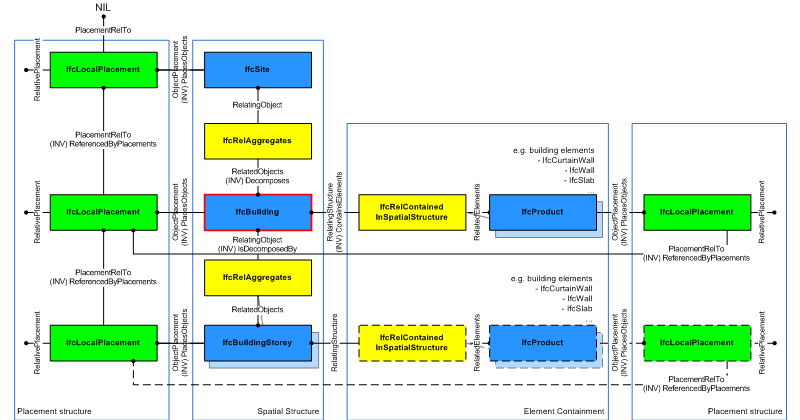

# IfcBuilding

A building represents a structure that provides shelter for its occupants or contents and stands in one place. The building is also used to provide a basic element within the spatial structure hierarchy for the components of a building project (together with site, storey, and space).

> NOTE  Definition from ISO 6707-1:
> Construction work that has the provision of shelter for its occupants or contents as one of its main purpose and is normally designed to stand permanently in one place.

A building is (if specified) associated to a site. A building may span over several connected or disconnected buildings. Therefore building complex provides for a collection of buildings included in a site. A building can also be decomposed in (vertical) parts, where each part defines a building section. This is defined by the composition type attribute of the supertype _IfcSpatialStructureElements_ which is interpreted as follow:

* **COMPLEX**: building complex
* **ELEMENT**: building
* **PARTIAL**: building section

The _IfcBuilding_ is used to build the spatial structure of a building (that serves as the primary project breakdown and is required to be hierarchical). The spatial structure elements are linked together by using the objectified relationship _IfcRelAggregates_. Figure 1 shows the _IfcBuilding_ as part of the spatial structure. It also serves as the spatial container for building and other elements.

> NOTE  Detailed requirements on mandatory element containment and placement structure relationships are given in model view definitions.

Figure 1 &mdash; Building composition

Systems, such as building service or electrical distribution systems, zonal systems, or structural analysis systems, relate to _IfcBuilding_ by using the objectified relationship _IfcRelServicesBuildings_.

Figure 2 describes the heights and elevations of the _IfcBuilding_. It is used to provide the height above sea level of the project height datum for this building, that is, the internal height 0.00. The height 0.00 is often used as a building internal reference height and equal to the floor finish level of the ground floor.

* total height of building, also referred to as ridge height (top of roof structure, e.g the ridge against terrain): provided by _Qto_BuildingBaseQuantities_ with Name="Height"
* eaves height of building (base of roof structure, e.g the eaves against terrain): provided by _Qto_BuildingBaseQuantities_ with Name="EavesHeight"

Figure 2 &mdash; Building elevations

> HISTORY  New entity in IFC1.0.

## Attributes

### ElevationOfRefHeight
Elevation above sea level of the reference height used for all storey elevation measures, equals to height 0.0. It is usually the ground floor level.

> IFC4.3.0.0 DEPRECATION This attribute is deprecated and shall no longer be used.

### ElevationOfTerrain
Elevation above the minimal terrain level around the foot print of the building, given in elevation above sea level.

> IFC4.3.0.0 DEPRECATION This attribute is deprecated and shall no longer be used.

### BuildingAddress

## Concepts

### Body Geometry

The body (or solid model) geometric representation (if the building has an independent geometric representation) of IfcBuilding is defined using faceted B-Rep capabilities (with or without voids), based on the IfcFacetedBrep or on the IfcFacetedBrepWithVoids.

> NOTE  Since the building shape is usually described by the exterior building elements, an independent shape representation shall only be given, if the building is exposed independently from its constituting elements and such independent geometric representation may be prohibited in model view definitions.

### Building Attributes

The usage of building address, elevation measures and composition type is governed by this concept.

### FootPrint GeomSet Geometry

The foot print representation of IfcBuilding is given by either a single 2D curve (such as IfcPolyline or IfcCompositeCurve), or by a list of 2D curves (in case of inner boundaries), if the building has an independent geometric representation.

> NOTE  The independent geometric representation of IfcBuilding may not be allowed in certain model view definitions. In those cases only the contained elements and spaces have an independent geometric representation.

### Product Local Placement

The local placement for IfcBuilding is defined in its supertype IfcProduct. It is defined by the IfcLocalPlacement, which defines the local coordinate system that is referenced by all geometric representations.

* The PlacementRelTo relationship of IfcLocalPlacement shall point (if relative placement is used) to the IfcSpatialStructureElement of type IfcSite, or of type IfcBuilding (e.g. to position a building relative to a building complex, or a building section to a building).
* If the relative placement is not used, the absolute placement is defined within the world coordinate system.

### Property Sets for Objects

### Quantity Sets

### Spatial Composition

> NOTE  By using the inverse relationship _IfcBuilding.Decomposes_ it references IfcProject || IfcSite || IfcBuilding through _IfcRelAggregates.RelatingObject_. If it refers to another instance of IfcBuilding, the referenced IfcBuilding needs to have a different and higher CompositionType, i.e. COMPLEX (if the other IfcBuilding has ELEMENT), or ELEMENT (if the other IfcBuilding has PARTIAL).

### Spatial Container

> NOTE  If there are building elements and/or other elements directly related to the IfcBuilding (like a curtain wall spanning several stories), they are associated with the IfcBuilding by using the objectified relationship IfcRelContainedInSpatialStructure. The IfcBuilding references them by its inverse relationship: > *  _IfcBuilding.ContainsElements_ -- referencing any subtype of IfcProduct (with the exception of other spatial structure element) by _IfcRelContainedInSpatialStructure.RelatedElements_.

#### IfcAnnotation

Annotations that are directly related to the building.

### Spatial Decomposition

> NOTE  By using the inverse relationship _IfcBuilding.IsDecomposedBy_ it references IfcBuilding || IfcBuildingStorey through _IfcRelAggregates.RelatedObjects_. If it refers to another instance of IfcBuilding, the referenced IfcBuilding needs to have a different and lower CompositionType, i.e. ELEMENT (if the other IfcBuilding has COMPLEX), or PARTIAL (if the other IfcBuilding has ELEMENT).
