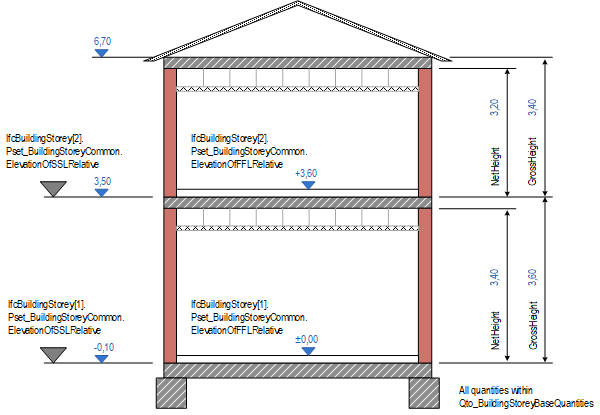

# IfcBuildingStorey

The building storey has an elevation and typically represents a (nearly) horizontal aggregation of spaces that are vertically bound.

A storey is (if specified) associated to a building. A storey may span over several connected storeys. Therefore storey complex provides for a collection of storeys included in a building. A storey can also be decomposed in (horizontical) parts, where each part defines a partial storey. This is defined by the composition type attribute of the supertype _IfcSpatialStructureElements_ which is interpreted as follow:

* **COMPLEX**: building storey complex
* **ELEMENT**: building storey
* **PARTIAL**: partial building storey

> EXAMPLE  In split level houses, a storey is split into two or more partial storeys, each with a different elevation. It can be handled by defining a storey, which includes two or more partial storeys with the individual elevations.

The _IfcBuildingStorey_ is used to build the spatial structure of a building (that serves as the primary project breakdown and is required to be hierarchical). The spatial structure elements are linked together by using the objectified relationship _IfcRelAggregates_.

Figure 1 shows the _IfcBuildingStorey_ as part of the spatial structure. It also serves as the spatial container for building and other elements.

> NOTE  Detailed requirements on mandatory element containment and placement structure relationships are given in view definitions and implementer agreements.

Figure 2 describes the heights and elevations of the _IfcBuildingStorey_.

* elevation of storey provided by: _IfcBuildingStorey.Elevation_ as a local height value relative to _IfcBuilding.ElevationOfRefHeight_, it is usually the top of construction slab
* net height of storey, also referred to as total height or system height (top of construction slab to top of construction slab above): provided by BaseQuantity with Name="GrossHeight"
* net height of storey (top of construction slab to bottom of construction slab above): provided by BaseQuantity with Name="NetHeight"

> HISTORY  New entity in IFC1.0

## Attributes

### Elevation
Elevation of the base of this storey, relative to the 0,00 internal reference height of the building. The 0.00 level is given by the absolute above sea level height by the _ElevationOfRefHeight_ attribute given at _IfcBuilding_.\X\0D
\X\0D
> NOTE  If the geometric data is provided (_ObjectPlacement_ is specified), the _Elevation_ value shall either not be included, or be equal to the local placement Z value.

## Concepts

### Body Geometry

The body (or solid model) geometric representation (if the
building storey has an independent geometric representation) of
IfcBuildingStorey is defined using faceted B-Rep
capabilities (with or without voids), based on the
IfcFacetedBrep or on the
IfcFacetedBrepWithVoids.

> NOTE  Since the building storey shape is usually described by the
>  exterior building elements, an independent shape representation
> shall only be given, if the building storey is exposed
> independently from its constituting elements and such independent geometric representation may be prohibited in model view definitions.

### FootPrint GeomSet Geometry

The foot print representation of IfcBuildingStorey is
given by either a single 2D curve (such as IfcPolyline or
IfcCompositeCurve), or by a list of 2D curves (in case of
inner boundaries), if the building storey has an independent
geometric representation.

> NOTE  The independent geometric representation of IfcBuildingStorey may not be allowed in certain model view definitions. In those cases only the contained elements and spaces have an independent geometric representation.

### Placement

The local placement for IfcBuildingStorey is defined in
its supertype IfcProduct. It is defined by the
IfcLocalPlacement, which defines the local coordinate
system that is referenced by all geometric representations.

* The PlacementRelTo relationship of
IfcLocalPlacement shall point (if relative placement is
used) to the IfcSpatialStructureElement of type
IfcBuilding, or of type IfcBuildingStorey (e.g. to
position a building storey relative to a building storey complex,
or a partial building storey to a building storey).
* If the relative placement is not used, the absolute placement
is defined within the world coordinate system.

### Property Sets for Objects

### Quantity Sets

### Spatial Composition

> NOTE  By using the inverse relationship IfcBuildingStorey.Decomposes it references
> (IfcBuilding || IfcBuildingStorey) through
> IfcRelAggregates.RelatingObjectIfcBuildingStorey, the referenced
> IfcBuildingStorey needs to have a different and higher
>  CompositionType, i.e. COMPLEX (if the other IfcBuildingStorey has ELEMENT), or ELEMENT (if the other
>  IfcBuildingStorey has PARTIAL).

### Spatial Container

If there are building elements and/or other elements directly
related to the IfcBuildingStorey (like most building
elements, such as walls, columns, etc.), they are associated with
the IfcBuildingStorey by using the objectified
relationship IfcRelContainedInSpatialStructure. The
IfcBuildingStorey references them by its inverse
relationship:

* IfcBuildingStorey.ContainsElements -- referencing any
subtype of IfcProduct (with the exception of other spatial
structure element) by
IfcRelContainedInSpatialStructure.RelatedElements.

Elements can also be referenced in an
IfcBuildingStorey, for example, if they span through several
storeys. This is expressed by using the objectified relationship
IfcRelReferencedInSpatialStructure. Systems, such as
building service or electrical distribution systems, zonal
systems, or structural analysis systems, relate to
IfcBuildingStorey by using the objectified relationship
IfcRelServicesBuildings.

### Spatial Decomposition

> NOTE  By using the inverse relationship IfcBuildingStorey.IsDecomposedBy it references
> IfcBuildingStorey || IfcSpace through
> IfcRelAggregates.RelatedObjects. If it refers to another
> instance of IfcBuildingStorey, the referenced
> IfcBuildingStorey needs to have a different and lower
> CompositionType, i.e. ELEMENT (if the other
> IfcBuildingStorey has COMPLEX), or PARTIAL (if the other
> IfcBuildingStorey has ELEMENT).

> NOTE  Multi storey spaces shall be spatially contained by only a single building storey, usually it is the building storey where the base of the space lies.

