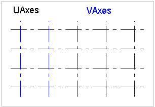
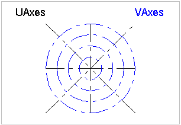
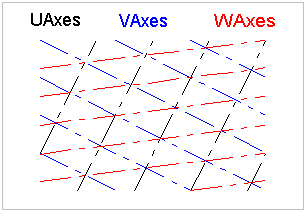
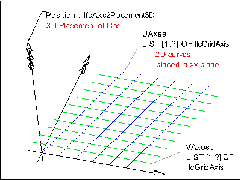
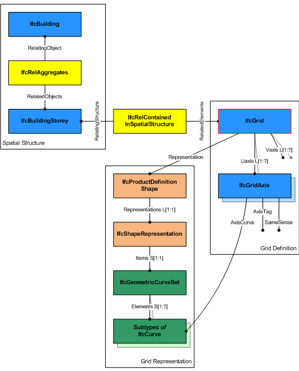

# IfcGrid

_IfcGrid_ ia a planar design grid defined in 3D space used as an aid in locating structural and design elements. The position of the grid (_ObjectPlacement_) is defined by a 3D coordinate system (and thereby the design grid can be used in plan, section or in any position relative to the world coordinate system). The position can be relative to the object placement of other products or grids. The XY plane of the 3D coordinate system is used to place the grid axes, which are 2D curves (for example, line, circle, arc, polyline).

The inherited attributes _Name_ and _Description_ can be used to define a descriptive name of the grid and to indicate the grid's purpose. A grid is defined by (normally) two, or (in case of a triangular grid) three lists of grid axes. The following figures/ shows some examples.

A grid may support a rectangular layout as shown in Figure 1, a radial layout as shown in Figure 2, or a triangular layout as shown in Figure 3.

> NOTE  The _PredefinedType_ denotes the type of grid that is represented by _IfcGrid_. The instantiation of _IfcGridAxis_'s has to agree to the _PredefinedType_, if provided.

> NOTE  The grid axes, defined within the design grid, are those elements to which project objects will be placed relatively using the _IfcGridPlacement_.

Figure 1 &mdash; Grid rectangular layout

Figure 2 &mdash; Grid radial layout

Figure 3 &mdash; Grid triangular layout

> HISTORY  New entity in IFC1.0.

{ .change-ifc2x4}
> IFC4 CHANGE  The attribute _PredefinedType_ has been added at the end of the attribute list.

{ .spec-head}
Informal Propositions:

 1. Grid axes, which are referenced in different lists of axes (UAxes, VAxes, WAxes) shall not be parallel.
 2. Grid axes should be defined such as there are no two grid axes which intersect twice (see Figure 4).

> NOTE  Left side: ambiguous intersections A1 and A2, a grid containing such grid axes is not a valid design grid;  Right side: the conflict can be resolved by splitting one grid axis in a way, such as no ambiguous intersections exist.

Figure 4 &mdash; Grid intersections

## Attributes

### UAxes
List of grid axes defining the first row of grid lines.

### VAxes
List of grid axes defining the second row of grid lines.

### WAxes
List of grid axes defining the third row of grid lines. It may be given in the case of a triangular grid.

### PredefinedType
Predefined types to define the particular type of the grid.
{ .change-ifc4}
> IFC4 Change  New attribute.

## Concepts

### Footprint Geometry

 The 2D geometric representation of IfcGrid is defined
 using the 'GeometricCurveSet' geometry. The following
 attribute values should be inserted

* IfcShapeRepresentation.RepresentationIdentifier =
 'FootPrint'.
* IfcShapeRepresentation.RepresentationType =
 'GeometricCurveSet' .

 The following constraints apply to the 2D representation:

* The IfcGeometricCurveSet shall be an (and the
 only) Item of the IfcShapeRepresentation. It
 should contain an IfcGeometricCurveSet containing
 subtypes of IfcCurve, each representing a grid axis.
 Applicable subtypes of IfcCurve are:
 IfcPolyline, IfcCircle, IfcTrimmedCurve
 (based on BaseCurve referencing IfcLine or
 IfcCircle), and IfcOffsetCurve2D.
* Each subtype of IfcCurve may have a curve style
 assigned, using IfcStyledItem referencing
 IfcCurveStyle.
* Optionally the grid axis labels may be added as
 IfcTextLiteral, and they may have text styles
 assigned, using IfcStyledItem referencing
 IfcTextStyle.

>
>  As shown in Figure 31, the IfcGrid defines a
>  placement coordinate system using the
>  ObjectPlacement. The XY plane of the
>  coordinate system is used to place the 2D grid axes.
>  The Representation of IfcGrid is
>  defined using IfcProductRepresentation,
>  referencing an IfcShapeRepresentation, that
>  includes IfcGeometricCurveSet as
>  Items. All grid axes are added as
>  IfcPolyline to the
>  IfcGeometricCurveSet.
>

Figure 157 — Grid layout

  

  

>
>  As shown in Figure 32, the attributes UAxes
>  and VAxes define lists of IfcGridAxis
>  within the context of the grid. Each instance of
>  IfcGridAxis refers to the same instance of
>  IfcCurve (here the subtype IfcPolyline)
>  that is contained within the
>  IfcGeometricCurveSet that represents the
>  IfcGrid.
>

Figure 158 — Grid representation

  

### Placement

 The local placement for IfcGrid is defined in its
 supertype IfcProduct. It is defined by the
 IfcLocalPlacement, which defines the local coordinate
 system that is referenced by all geometric representations.

* The PlacementRelTo relationship of
 IfcLocalPlacement shall point (if given) to the local
 placement of the same IfcSpatialStructureElement,
 which is used in the ContainedInStructure inverse
 attribute, or to a spatial structure element at a higher
 level, referenced by that.
* If the relative placement is not used, the absolute
 placement is defined within the world coordinate system.

