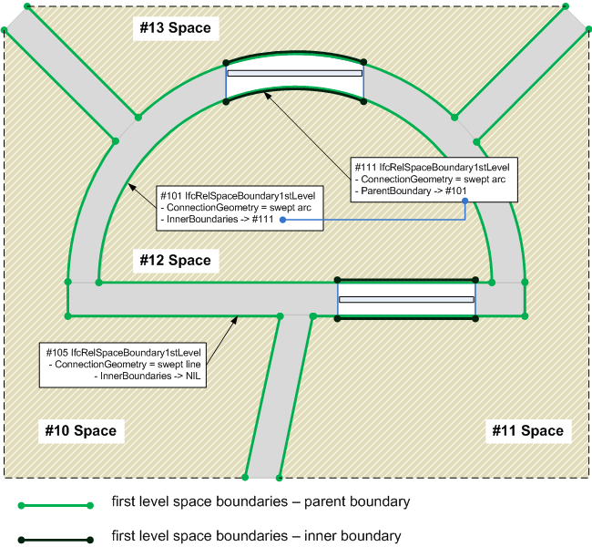

# IfcRelSpaceBoundary1stLevel

The 1st level space boundary defines the physical or virtual delimiter of a space by the relationship _IfcRelSpaceBoundary1stLevel_ to the surrounding elements. 1st level space boundaries are characterizeda by:

* 1st level space boundaries are the boundaries of a space defined by the surfaces of building elements bounding this space (physical space boundaries) or by virtual surfaces provided by an adjacent space with no dividing wall.
* 1st level space boundaries do not consider any change of material in the bounding building elements, or different spaces/zones behind a wall or slab (floor or ceiling).
* 1st level space boundaries are differentiated in two ways: virtual or physical and internal,external, or undefined (internal and external) e.g. for a wall that is partially inside and outside.
* 1st level space boundaries form a closed shell around the space (so long as the space is completely enclosed) and include overlapping boundaries representing openings (filled or not) in the building elements (see implementers agreement below).

1st level space boundaries define a space by its boundary surfaces without taking anything on the other side of the bounding elements into account.

> NOTE  1st level space boundaries are used e.g. in quantity take-off and facility management as they describe the surfaces for finishes. They cannot be directly used for thermal analysis. However 1st level space boundaries can provide the input to preprocessors to thermal analysis software that take 1st level space boundaries and perform the necessary transformation into 2nd level space boundaries that are required for energy analysis.

> HISTORY  New entity in IFC4.

{ .use-head}
Relationship Use Definitions

As shown in Figure 1, the attribute _ParentBoundary_ with inverse _InnerBoundaries_ is provided to link the space boundaries of doors, windows, and openings to the parent boundary, such as of a wall or slab.

> NOTE  The space boundary of the parent is not cut by the inner boundary - both overlap.

{ .use-head}
Geometry Use Definitions

See the definition at the supertype IfcRelSpaceBoundary for guidance on using the connection geometry for first level space boundaries.

## Attributes

### ParentBoundary
Reference to the host, or parent, space boundary within which this inner boundary is defined.

### InnerBoundaries
Reference to the inner boundaries of the space boundary. Inner boundaries are defined by the space boundaries of openings, doors and windows.
