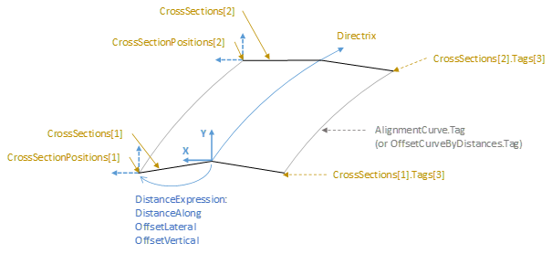
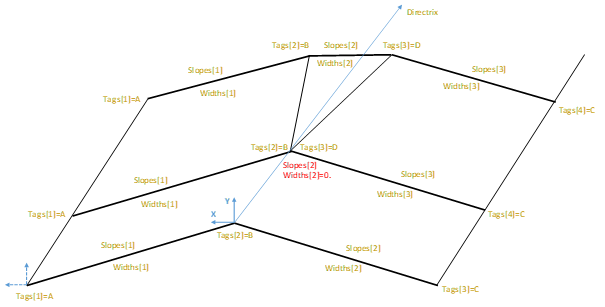

# IfcSectionedSurface

A kind of surface constructed by sweeping potentially varying open cross sections along a curve horizontally (or near horizontally). The surface is generated by sweeping the CrossSections between CrossSectionPositions; linear interpolation is assumed, unless transitions curves between cross section points are indicated by OpenCrossProfileDef.Tags.
The CrossSections are oriented with the Y axis of each profile facing upwards in +Z direction or vertically perpendicular to the Directrix, depending on the Attribute FixedAxisVertical value.

Figure 1 &mdash; Sectioned surface using _IfcOpenCrossProfileDef_

In case of branching longitudinal breaklines, the SectionedSurface may use OpenCrossProfileDef instances with varying number of cross section points. In that case, the point in two consecutive cross sections that are connected are identified by the same tag value.

Figure 2 &mdash; Sectioned surface with branching longitudinal breaklines

Informal Propositions:

1. No two consecutive sections shall intersect.
2. If the directrix is not tangent continuous, the resulting surface is created by a miter at half angle between the two segments.
3. Very sharp edges may result in nearly impossible miter; implementer agreements may define acceptable limits for tangent discontinuity or require the directrix to be tangent continuous.
4. The directrix shall not intersect

## Attributes

### Directrix
The curve used to define the sweeping operation

### CrossSectionPositions
List of distance expressions in sequentially increasing order paired with CrossSections, indicating the position of the corresponding section along the Directrix.

### CrossSections
List of cross sections in sequential order along the Directrix

### FixedAxisVertical
Indicates whether Sections are oriented with the Y axis of each profile facing upwards in +Z direction (True), or vertically perpendicular to the Directrix varying according to slope (False)

## Formal Propositions

### DirectrixIs3D
The curve entity which is the underlying directrix shall have the dimensionality of 3.

### ProfilesAreCurves
The profile type shall be CURVE within the list of the profiles defining the cross sections.

### SameProfileType
The entity type for each section must be the same.

### CorrespondingLists
The list of cross sections and the list of cross section positions shall be of the same size.
