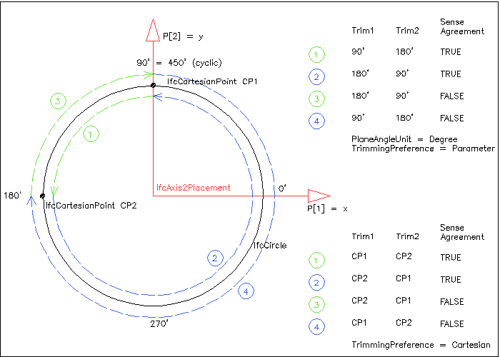

# IfcTrimmedCurve

An _IfcTrimmedCurve_ is a bounded curve that is trimmed at both ends. The trimming points may be provided by a Cartesian point or by a parameter value, based on the parameterization of the _BasisCurve_. The _SenseAgreement_ attribute indicates whether the direction of the _IfcTrimmedCurve_ agrees with or is opposed to the direction of the _BasisCurve_.

> NOTE  In case of the _BasisCurve_ being a closed curve, such as an _IfcCircle_ or _IfcEllipse_, the _SenseAgreement_ affects the geometric shape of the _IfcTrimmedCurve_.

Figure 1 shows the four arcs (dashed blue and green lines with arrow showing different orientations) that can be defined by the same _BasisCurve_ (of type _IfcCircle_) and the same trimming points (given by Cartesian points and parameter values) by using different assignments to _Trim1_ and _Trim2_ and _SenseAgreement_.

> NOTE  Since the _BasisCurve_ is closed (type _IfcCircle_), the exception of the informal proposition IP3 applies, i.e. the sense flag is not required to be consistent with the parameter values of _Trim1_ and _Trim1_, so the rule (sense = parameter 1 < parameter 2) may not be fulfilled.

{ .extDef}
> NOTE Definition according to ISO/CD 10303-42:1992
> A trimmed curve is a bounded curve which is created by taking a selected portion, between two identified points, of the associated basis curve. The basis curve itself is unaltered and more than one trimmed curve may reference the same basis curve. Trimming points for the curve may be identified by:
>
> * parametric value
> * geometric position
> * both of the above

At least one of these shall be specified at each end of the curve. The _SenseAgreement_ makes it possible to unambiguously define any segment of a closed curve such as a circle. The combinations of sense and ordered end points make it possible to define four distinct directed segments connecting two different points on a circle or other closed curve. For this purpose cyclic properties of the parameter range are assumed; for example, 370 degrees is equivalent to 10 degrees.
>
> The _IfcTrimmedCurve_ has a parameterization which is inherited from the particular basis curve reference. More precisely the parameter s of the trimmed curve is derived from the parameter of the basis curve as follows:
>
> * if _SenseAgreement_ is TRUE: _s = t - t~1~_
> * if _SenseAgreement_ is FALSE: _s = t~2~ - t_

In the above equations t~1~ is the value given by _Trim1_ or the parameter value corresponding to point 1 and t~2~ is the value given by _Trim2_ or the parameter value corresponding to point 2. The resultant _IfcTrimmedCurve_ has a parameter ranging from 0 at the first trimming point to |t~2~ - t~1~| at the second trimming point.
>
>> NOTE  In case of a closed curve, it may be necessary to increment t1 or t2 by the parametric length for consistency with the sense flag.

>
> NOTE Entity adapted from **trimmed_curve** defined in ISO 10303-42

> HISTORY  New entity in IFC1.0

{ .spec-head}
Informal Propositions:

1. Where both the parameter value and the Cartesian point exist for _Trim1_ and _Trim2_ they shall be consistent. (i.e., the _BasisCurve_ evaluated at the parameter value shall coincide with the specified point).
2. When a Cartesian point is specified by _Trim1_ or by _Trim2_ it shall lie on the _BasisCurve_.
3. Except the case of a closed _BasisCurve_ where both parameter 1 and parameter 2 exist, they shall be consistent with the sense flag, i.e., (sense = parameter 1 < parameter 2). Or, for every open curve where both parameter 1 and parameter 2 exist, they shall be consistent with the _SenseAgreement_, i.e., _SenseAgreement_ = (parameter 1 < parameter 2).
4. If both parameter 1 and parameter 2 exist, then parameter 1 <> parameter 2. For a closed base curve, e.g. _IfcCircle_ or _IfcEllipse_, this also applies to the cyclic properties, as 360' is equal to 0', parameter 1 = 360' and parameter 2 = 0' are treated as being equal and therefore violating this proposition.
5. When a parameter value is specified by _Trim1_ or _Trim2_ it shall lie within the parametric range of the _BasisCurve_.

## Attributes

### BasisCurve
The curve to be trimmed. For curves with multiple representations any parameter values given as Trim1 or Trim2 refer to the master representation of the BasisCurve only.

### Trim1
The first trimming point which may be specified as a Cartesian point, as a real parameter or both.

### Trim2
The second trimming point which may be specified as a Cartesian point, as a real parameter or both.

### SenseAgreement
Flag to indicate whether the direction of the trimmed curve agrees with or is opposed to the direction of the basis curve.

### MasterRepresentation
Where both parameter and point are present at either end of the curve this indicates the preferred form.

## Formal Propositions

### Trim1ValuesConsistent
Either a single value is specified for Trim1, or the two trimming values are of different type (point and parameter)

### Trim2ValuesConsistent
Either a single value is specified for Trim2, or the two trimming values are of different type (point and parameter)

### NoTrimOfBoundedCurves
Already bounded curves shall not be trimmed.
