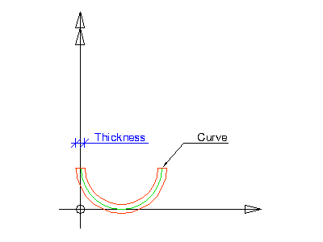

# IfcCenterLineProfileDef

The profile _IfcCenterLineProfileDef_ defines an arbitrary two-dimensional open, not self intersecting profile for the use within the swept solid geometry. It is given by an area defined by applying a constant thickness to a centerline, generating an area from which the solid can be constructed.

Among else, _IfcCenterLineProfileDef_ is used to model cold-formed steel or aluminium sections (Sigma, Zeta, Omega, and similar sections which are not covered by subtypes of _IfcParameterizedProfileDef_). However, since _IfcCenterLineProfileDef_ does not provide shape parameters except for the thickness, there is generally a need to further specify the profile definition by means of

* the name, 
* external reference to a document or library,
* profile properties,

or a combination of them. See _IfcProfileDef_ for guidance on external references for profiles.

> HISTORY  New entity in IFC2x3.

{ .spec-head}
Informal Propositions:

1. The _Curve_ has to be an open curve.
2. The _Curve_ has to be a non-intersecting curve.

Figure 1 illustrates the center line profile definition. The _Curve_ is defined in the underlying coordinate system. The underlying coordinate system is defined by the swept surface that uses the profile definition. It is the xy plane of:

* _IfcSweptSurface.Position_

The _Curve_ attribute defines a two dimensional open bounded curve. The _Thickness_ attribute defines a constant thickness along the curve.

## Attributes

### Thickness
Constant thickness applied along the center line.
