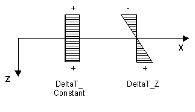

# IfcStructuralLoadTemperature

An instance of the entity _IfcStructuralLoadTemperature_ shall be used to define actions which are caused by a temperature change. As shown in Figure 1, the change of temperature is given with a constant value which is applied to the complete section and values for temperature differences between outer fibres of the section.

> HISTORY  New entity in IFC2x2.

## Attributes

### DeltaTConstant
Temperature change which affects the complete section of the structural member, or the uniform portion of a non-uniform temperature change.

> NOTE  A positive value describes an increase in temperature. I.e. a positive constant temperature change causes elongation of a member, or compression in the member if there are respective restraints.

### DeltaTY
Non-uniform temperature change, specified as the difference of the temperature change at the outer fibre of the positive y direction minus the temperature change at the outer fibre of the negative y direction of the analysis member.

> NOTE  A positive non-uniform temperature change in y induces a negative curvature of the member about z, or a positive bending moment about z if there are respective restraints. y and z are local member axes.

### DeltaTZ
Non-uniform temperature change, specified as the difference of the temperature change at the outer fibre of the positive z direction minus the temperature change at the outer fibre of the negative z direction of the analysis member.

> NOTE  A positive non-uniform temperature change in z induces a positive curvature of the member about y, or a negative bending moment about y if there are respective restraints. y and z are local member axes.
