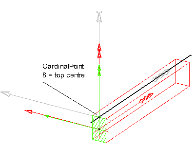
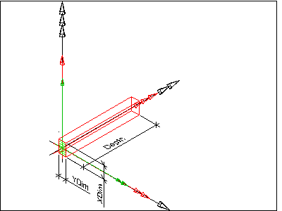
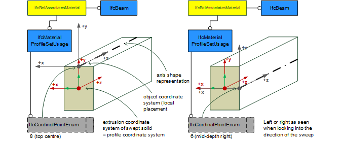
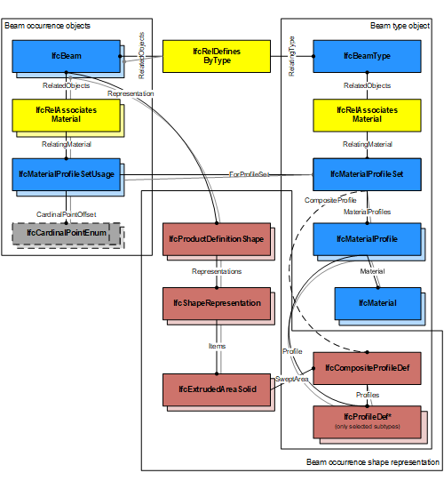

# IfcBeam

An _IfcBeam_ is a horizontal, or nearly horizontal, structural member that is capable of withstanding load primarily by resisting bending. It represents such a member from an architectural point of view. It is not required to be load bearing.

> NOTE  Definition according to ISO 6707-1: structural member for carrying load(s) between or beyond points of support, usually narrow in relation to its length and horizontal or nearly so.

There are two main representations for beam occurrences:

- _IfcBeam_ with _IfcMaterialProfileSetUsage_ is used for all occurrences of beams, that have a profile defined that is swept along a directrix. The profile might be changed uniformly by a taper definition along the directrix. The profile parameter and its cardinal point of insertion can be fully described by the _IfcMaterialProfileSetUsage_. These beams are always represented geometricly by an 'Axis' and a 'SweptSolid' or 'AdvancedSweptSolid' shape representation (or by a 'Clipping' geometry based on the swept solid), if a 3D geometric representation is assigned.

- _IfcBeam_ without _IfcMaterialProfileSetUsag_e is used for all other occurrences of beams, particularly for beams with non-uniformly changing profile sizes along the sweep, or beams having only 'AdvancedBrep', 'Brep', or 'SurfaceModel' geometry, or if a more parametric representation is not intended.

> NOTE  The entity IfcBeamStandardCase has been deprecated, IfcBeam with IfcMaterialProfileSetUsage is used instead.

For any other longitudinal structural member, not constrained to be predominately horizontal nor vertical, or where this semantic information is irrelevant, the entity _IfcMember_ should be used.

> NOTE  The representation of load-bearing beams in a structural analysis model is provided by subtypes of _IfcStructuralMember_ (with _IfcStructuralCurveMember_ being mostly applicable) as part of an _IfcStructuralAnalysisModel_. The camber of a beam may be defined by assigning an _IfcStructuralCurveMember_ with displacement coordinates. Multiple sets of camber ordinates may be provided that are qualified by the particular load case, where full dead load would typically be used for fabrication, and other scenarios used for other loading conditions such as during construction.

> HISTORY  New entity in IFC1.0

## Attributes

### PredefinedType
Predefined generic type for a beam that is specified in an enumeration. There may be a property set given specifically for the predefined types.
> NOTE  The _PredefinedType_ shall only be used, if no _IfcBeamType_ is assigned, providing its own _IfcBeamType.PredefinedType_.

{ .change-ifc2x4}
> IFC4 CHANGE The attribute has been added at the end of the entity definition.

## Formal Propositions

### CorrectPredefinedType
Either the _PredefinedType_ attribute is unset (e.g. because an _IfcBeamType_ is associated), or the inherited attribute _ObjectType_ shall be provided, if the _PredefinedType_ is set to USERDEFINED.

### CorrectTypeAssigned
Either there is no beam type object associated, i.e. the _IsTypedBy_ inverse relationship is not provided, or the associated type object has to be of type _IfcBeamType_.

## Concepts

### Axis 3D Geometry

The axis representation can be used to represent the system
 length of a beam that may extent the body length of the
 beam.

> NOTE  The 'Axis' is used to locate the
> material profile set, if the material association is of type IfcMaterialProfileSetUsage.

The following additional constraints apply to the 'Axis'
representation, if an IfcMaterialProfileSetUsage is provided and the 'Body' shape representation has the
RepresentationType: 'SweptSolid':

* Axis
	+ IfcPolyline having two Points, or
	IfcTrimmedCurve with BasisCurve of Type
	IfcLine for 'SweptSolid' provided as
	IfcExtrudedAreaSolid. The axis curve lies on the z axis of
	the object coordinate system.
	+ IfcTrimmedCurve with BasisCurve of Type
	IfcCircle for 'SweptSolid' provided as
	IfcRevolvedAreaSolid. The axis curve lies on the x/z plane
	of the object coordinate system, the tangent at the start is along
	the positive z-axis.

 

> EXAMPLE  As shown in Figure 76, the axis shall be defined along the z axis of the object coordinate system. The axis representation can be used to represent the system length of a beam that may extent the body length of the beam.

Figure 198 — Beam axis representation

 

> EXAMPLE  As shown in Figure 77, the axis representation shall be used to represent the cardinal point as the offset between the 'Axis' and the extrusion path of the beam. The extrusion path is provided as IfcExtrudedAreaSolid.ExtrudedDirection and should be parallel to the 'Axis' and the z axis. It has to be guaranteed that the value provided by
> IfcMaterialProfileSetUsage.CardinalPoint is consistent to the IfcExtrudedAreaSolid.Position.

Figure 199 — Beam axis cardinal point

 

### Body AdvancedSweptSolid Geometry

The following additional constraints apply to the 'AdvancedSweptSolid' representation type:

* Solid: IfcSurfaceCurveSweptAreaSolid,
IfcFixedReferenceSweptAreaSolid,
IfcExtrudedAreaSolidTapered,
IfcRevolvedAreaSolidTapered shall be supported.

> NOTE  View definitions and implementer agreement
> can further constrain the allowed swept solid
> types.
* Profile: see 'SweptSolid' geometric representation
* Extrusion: not applicable

### Body Clipping Geometry

The following additional constraints apply to the 'Clipping' representation type:

* Solid: see 'SweptSolid' geometric representation
* Profile: see 'SweptSolid' geometric representation
* Extrusion: see 'SweptSolid' geometric representation
* Boolean result: The IfcBooleanClippingResult
shall be supported, allowing for Boolean differences between the
swept solid (here IfcExtrudedAreaSolid) and one or several
IfcHalfSpaceSolid (or its subtypes).

Figure 201 illustrates use of IfcBooleanClippingResult between an IfcExtrudedAreaSolid and an IfcHalfSpaceSolid to create a clipped body.

Figure 201 — Beam clipping

### Body SweptSolid Geometry

The following additional constraints apply to the 'SweptSolid' representation type:

* Solid: IfcExtrudedAreaSolid,
IfcRevolvedAreaSolid shall be supported
* Profile: all subtypes of IfcProfileDef (with
exception of IfcArbitraryOpenProfileDef)
* Extrusion:  All extrusion directions shall be
supported.

Figure 200 illustrates the 'SweptSolid' geometric representation. There are no restrictions or conventions on how to use the local placement (black), solid of extrusion placement (red) and profile placement (green).

Figure 200 — Beam swept solid

Figure 201 illustrates the use of non-perpendicular extrusion to create the IfcExtrudedAreaSolid.

Figure 201 — Beam non-perpendicular extrusion

### Element Composition

### Material Profile Set

The material information of the IfcBeam is defined by
IfcMaterialProfileSet or as fallback by IfcMaterial, and it is attached either directly or at the IfcBeamType. In this case, the material information does not allow to construct a shape by applying the profile definition to the axis representation, to enable this parametric definition, the IfcMaterialProfileSetUsage has to be used instead.

### Material Profile Set Usage

The Material Profile Set Usage defines the assignment of an IfcMaterialProfileSetUsage to the
IfcBeamType providing a common profile definition to all
 occurrences of this IfcBeamType. Beams with composite profile can be represented by referring to
 several IfcMaterialProfile's within the
IfcMaterialProfileSet that is referenced from the
IfcMaterialProfileSetUsage.

> EXAMPLE  Figure 196 illustrates assignment of IfcMaterialProfileSetUsage and IfcMaterialProfileSet to the IfcBeam as the beam occurrence and to the IfcBeamType. The same IfcMaterialProfileSet shall be shared by many occurrences of IfcMaterialProfileSetUsage. This relationship shall be consistent to the relationship between the IfcBeamType and the IfcBeam.

Figure 196 — Beam profile usage

 

> EXAMPLE  Figure 197 illustrates alignment of cardinal points.

> NOTE  It has to be guaranteed that the use of IfcCardinalPointEnum is consistent to the placement of the extrusion body provided by IfcExtrudedAreaSolid.Position

> NOTE  The cardinal points 8 (top centre) and 6 (mid-depth right) are assigned according to the definition at IfcCardinalPointReference

Figure 197 — Beam cardinal points

 

> EXAMPLE  Figure 198 illustrates assignment of a composite profile by using IfcCompositeProfile for geometric representation and several IfcMaterialProfile's within the IfcMaterialProfileSet.

Figure 198 — Beam composite profiles

### Object Typing

### Property Sets for Objects

### Quantity Sets

### Spatial Containment

The IfcBeam, as any subtype of IfcBuildingElement,
may participate alternatively in one of the two different containment relationships:

* the Spatial Containment (defined here), or
* the Element Composition.
