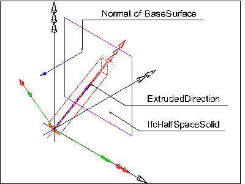
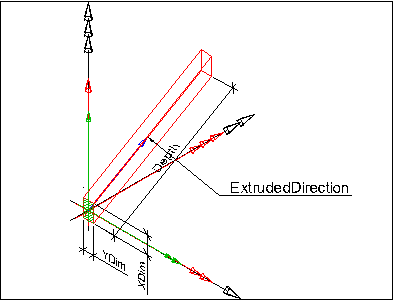

# IfcBeam

An _IfcBeam_ is a horizontal, or nearly horizontal, structural member that is capable of withstanding load primarily by resisting bending. It represents such a member from an architectural point of view. It is not required to be load bearing.

> NOTE  Definition according to ISO 6707-1: structural member for carrying load(s) between or beyond points of support, usually narrow in relation to its length and horizontal or nearly so.

There are two main representations for beam occurrences:

- _IfcBeam_ with _IfcMaterialProfileSetUsage_ is used for all occurrences of beams, that have a profile defined that is swept along a directrix. The profile might be changed uniformly by a taper definition along the directrix. The profile parameter and its cardinal point of insertion can be fully described by the _IfcMaterialProfileSetUsage_. These beams are always represented geometricly by an 'Axis' and a 'SweptSolid' or 'AdvancedSweptSolid' shape representation (or by a 'Clipping' geometry based on the swept solid), if a 3D geometric representation is assigned.

- _IfcBeam_ without _IfcMaterialProfileSetUsag_e is used for all other occurrences of beams, particularly for beams with non-uniformly changing profile sizes along the sweep, or beams having only 'AdvancedBrep', 'Brep', or 'SurfaceModel' geometry, or if a more parametric representation is not intended.

> NOTE  The entity IfcBeamStandardCase has been deprecated, IfcBeam with IfcMaterialProfileSetUsage is used instead.

For any other longitudinal structural member, not constrained to be predominately horizontal nor vertical, or where this semantic information is irrelevant, the entity _IfcMember_ should be used.

> NOTE  The representation of load-bearing beams in a structural analysis model is provided by subtypes of _IfcStructuralMember_ (with _IfcStructuralCurveMember_ being mostly applicable) as part of an _IfcStructuralAnalysisModel_. The camber of a beam may be defined by assigning an _IfcStructuralCurveMember_ with displacement coordinates. Multiple sets of camber ordinates may be provided that are qualified by the particular load case, where full dead load would typically be used for fabrication, and other scenarios used for other loading conditions such as during construction.

> HISTORY  New entity in IFC1.0

## Attributes

### PredefinedType
Predefined generic type for a beam that is specified in an enumeration. There may be a property set given specifically for the predefined types.
> NOTE  The _PredefinedType_ shall only be used, if no _IfcBeamType_ is assigned, providing its own _IfcBeamType.PredefinedType_.

{ .change-ifc2x4}
> IFC4 CHANGE The attribute has been added at the end of the entity definition.

## Formal Propositions

### CorrectPredefinedType
Either the _PredefinedType_ attribute is unset (e.g. because an _IfcBeamType_ is associated), or the inherited attribute _ObjectType_ shall be provided, if the _PredefinedType_ is set to USERDEFINED.

### CorrectTypeAssigned
Either there is no beam type object associated, i.e. the _IsTypedBy_ inverse relationship is not provided, or the associated type object has to be of type _IfcBeamType_.

## Concepts

### Axis 3D Geometry

The 'Axis' 'Curve 3D' geometry can be used to represent the system axis and length of a beam that may extent the body length.

> NOTE&nbsp; The 'Axis' is not used to locate the material profile set, only the subtype IfcBeamStandardCase provides this capability.

#### Axis_IfcBoundedCurve_Curve3D

Three-dimensional reference curve for the beam.

### Body AdvancedSweptSolid Geometry

The following additional constraints apply to the 'AdvancedSweptSolid' representation type:

* **Solid**: IfcSurfaceCurveSweptAreaSolid, IfcFixedReferenceSweptAreaSolid, IfcExtrudedAreaSolidTapered, IfcRevolvedAreaSolidTapered shall be supported. 
>> NOTE&nbsp; View definitions and implementer agreement can further constrain the allowed swept solid types. 
* **Profile**: see 'SweptSolid' geometric representation
* **Extrusion**: not applicable

### Body Clipping Geometry

The following additional constraints apply to the 'Clipping' representation type:

* **Solid**: see 'SweptSolid' geometric representation
* **Profile**: see 'SweptSolid' geometric representation
* **Extrusion**: see 'SweptSolid' geometric representation
* **Boolean result**: The IfcBooleanClippingResult shall be supported, allowing for Boolean differences between the swept solid (here IfcExtrudedAreaSolid) and one or several IfcHalfSpaceSolid (or its subtypes).

Figure 1 illustrates use of IfcBooleanClippingResult between an IfcExtrudedAreaSolid and an IfcHalfSpaceSolid to create a clipped body.

### Body SweptSolid Geometry

The following additional constraints apply to the 'SweptSolid' representation type:

* **Solid**: IfcExtrudedAreaSolid, IfcRevolvedAreaSolid shall be supported
* **Profile**: all subtypes of IfcProfileDef (with exception of IfcArbitraryOpenProfileDef)
* **Extrusion**:&nbsp; All extrusion directions shall be supported.

Figure 1 illustrates the 'SweptSolid' geometric representation. There are no restrictions or conventions on how to use the local placement (black), solid of extrusion placement (red) and profile placement (green).

Figure 2 illustrates the use of non-perpendicular extrusion to create the IfcExtrudedAreaSolid.

### Element Composition

#### IfcElementAssembly

Special purpose composite entity

#### IfcBuildingElement

Any building element can be a composite

### Material Profile Set

The material of the IfcBeam is defined by the IfcMaterialProfileSet or as fallback by IfcMaterial, and it is attached either directly or at the IfcBeamType.

> NOTE&nbsp; It is illegal to assign an IfcMaterialProfileSetUsage to an IfcBeam. Only the subtype IfcBeamStandardCase supports this concept.

### Object Typing

### Product Assignment

#### IfcStructuralCurveMember

An idealized structural member corresponding to the beam.

### Property Sets for Objects

### Quantity Sets

### Spatial Containment

The IfcBeam, as any subtype of IfcBuildingElement, may participate alternatively in one of the two different containment relationships:

* the _Spatial Containment_ (defined here), or
* the _Element Composition_.

#### IfcBuildingStorey

Default spatial container

#### IfcBuilding

Spatial container for the element if it cannot be assigned to a building storey

#### IfcSite

Spatial container for the element in case that it is placed on site (outside of building)

