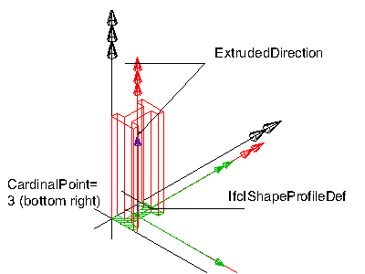
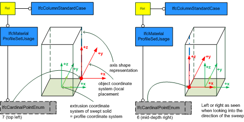
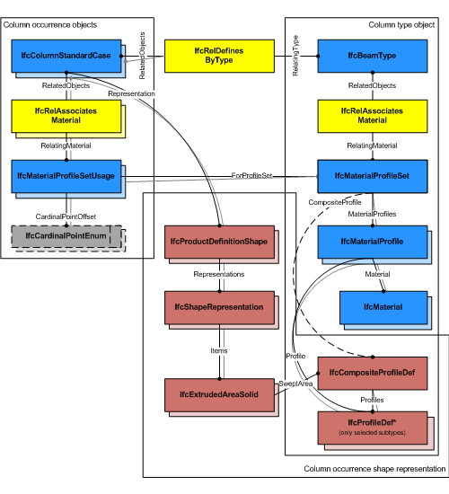

# IfcColumnStandardCase

The standard column, _IfcColumnStandardCase_, defines a column with certain constraints for the provision of material usage, parameters and with certain constraints for the geometric representation. The _IfcColumnStandardCase_ handles all cases of columns, that:

<ul>
<li>have a reference to the <em>IfcMaterialProfileSetUsage</em>
defining the material profile association of the column with the
cardinal point of its insertion relative to the local
placement.</li>
<li>are based on a sweep of a planar profile, or set of profiles,
as defined by the <em>IfcMaterialProfileSet</em></li>
<li>have an 'Axis' shape representation with constraints provided
below in the geometry use definition</li>
<li>have a 'Body' shape representation with constraints provided
below in the geometry use definition</li>
<li>have a start profile, or set of profiles, that is swept along
the directrix and might be changed uniformly by a taper
definition</li>
<li>are consistent in using the correct cardinal point offset of
the profile as compared to the 'Axis' and 'Body' shape
representation</li>
<li>are extruded perpendicular to the profile definition
plane</li>
<li style="list-style-type:none">
<blockquote class="note"><small>NOTE  View definitions and implementer
agreements may further constrain the applicable geometry types,
e.g. by excluding tapering from an <em>IfcBeamStandardCase</em>
implementation.</small></blockquote>
</li>
</ul>
> HISTORY  New entity in IFC4.

**_Geometric Representations_**

The geometric representation of _IfcColumnStandardCase_ is defined using the following multiple shape representations for its definition:

* **Axis**: A three-dimensional open curve (subtype of _IfcBoundedCurve_) defining the axis for the standard column. The cardinal point is determined by the column axis.
* **Body**: A Swept Solid Representation or a CSG representation defining the 3D shape of the standard column.

> NOTE  It is invalid to exchange a 'SurfaceModel', 'Brep', or 'MappedRepresentation' representation for the 'Body' shape representation of an _IfcColumnStandardCase_.

## Formal Propositions

### HasMaterialProfileSetUsage
A valid instance of _IfcColumnStandardCase_ relies on the provision of an _IfcMaterialProfileSetUsage_.

## Concepts

### Axis 3D Geometry

The following additional constraints apply to the 'Axis' representation, if the 'Body' shape representation has the RepresentationType : 'SweptSolid':

* Axis 
    * IfcPolyline having two Points, or IfcTrimmedCurve with BasisCurve of Type IfcLine for 'SweptSolid' provided as IfcExtrudedAreaSolid. The axis curve lies on the z axis of the object coordinate system.
    * IfcTrimmedCurve with BasisCurve of Type IfcCircle for 'SweptSolid' provided as IfcRevolvedAreaSolid. The axis curve lies on the x/z plane of the object coordinate system, the tangent at the start is along the positive z-axis. 

&nbsp;

<table border="0" cellpadding="2" cellspacing="2" summary="Axis">

 <tr>
  <td align="left" valign="top" width="300"></td>
  <td>
<blockquote class="example">EXAMPLE&nbsp; As shown in Figure 1, the axis shall be defined along the z axis of
the object coordinate system. The axis representation can be used to
represent the system length of a column that may extent the body
length of the column.</blockquote>

</td>
 </tr>
 
<tr>
  <td>
Figure 1 &mdash; Column axis representation
</td>
  <td>&nbsp;</td>
 </tr>

</table>

<table border="0" cellpadding="2" cellspacing="2" summary="Axis">
 
<tr>
  <td align="left" valign="top" width="300"></td>

  <td><blockquote class="example">EXAMPLE&nbsp; As shown in Figure 2, the axis representation shall be used to represent the cardinal point as the offset between the 'Axis' and the extrusion path of the column. The extrusion path is provided as <em>IfcExtrudedAreaSolid.ExtrudedDirection</em> and should be parallel to the 'Axis'. It has to be guaranteed that the value provided by <em>IfcMaterialProfileSetUsage.CardinalPoint</em> is consistent to the <em>IfcExtrudedAreaSolid.Position</em>.</blockquote>
 </td></tr>

 <tr>
  <td>
Figure 2 &mdash; Column axis cardinal point
</td>
  <td>&nbsp;</td>
 </tr>

</table>

### Body AdvancedSweptSolid Geometry

The following additional constraints apply to the 'AdvancedSweptSolid' representation type:

* **Solid**: IfcSurfaceCurveSweptAreaSolid, IfcFixedReferenceSweptAreaSolid, IfcExtrudedAreaSolidTapered, IfcRevolvedAreaSolidTapered shall be supported. 
>> NOTE&nbsp; View definitions and implementer agreement can further constrain the allowed swept solid types. 
* **Profile**: see 'SweptSolid' geometric representation
* **Profile Position** : see 'SweptSolid' geometric representation
* **Extrusion**: not applicable

### Body Clipping Geometry

The following constraints apply to the 'Clipping' representation:

* **Solid**: see 'SweptSolid' geometric representation
* **Profile**: see 'SweptSolid' geometric representation
* **Profile Position** : see 'SweptSolid' geometric representation
* **Extrusion**: see 'SweptSolid' geometric representation
* **Orientation**: see 'SweptSolid' geometric representation
* **Boolean result**: The IfcBooleanClippingResult shall be supported, allowing for Boolean differences between the swept solid (here IfcExtrudedAreaSolid) and one or several IfcHalfSpaceSolid (or its subtypes).

Figure 1 illustrates a 'Clipping' geometric representation with use of IfcBooleanClippingResult between an IfcExtrudedAreaSolid and an IfcHalfSpaceSolid to create a clipped body, with cardinal point applied as **2** (bottom centre).

### Body SweptSolid Geometry

The following additional constraints apply to the 'SweptSolid' representation:

* **Solid**: IfcExtrudedAreaSolid, IfcRevolvedAreaSolid shall be supported
* **Profile**: all subtypes of IfcProfileDef (with exception of IfcArbitraryOpenProfileDef)
* **Profile Position** : For all single profiles, the _IfcParameterizedProfileDef.Position_ shall be NIL, or having Location = 0.,0. and RefDirection = 1.,0.
* **Extrusion**: perpendicular to the profile direction. The _IfcExtrudedAreaSolid.ExtrudedDirection_ shall be [0.,0.,1.].
* **Orientation**: The y-axis of the profile, as determined by _IfcSweptAreaSolid.Position.P[2]_ shall point to the Y-Axis. It indicates the "role" of the column, a role=0&deg; means y-axis of profile = Y-axis of reference coordinate system.

Figure 1 illustrates a standard geometric representation with cardinal point applied as **5** (mid-depth centre).

The following interpretation of dimension parameter applies for rectangular columns:

* _IfcRectangleProfileDef.YDim_ interpreted as column width
* _IfcRectangleProfileDef.XDim_ interpreted as column depth

The following interpretation of dimension parameter applies for circular columns:

* _IfcCircleProfileDef.Radius_ interpreted as column radius.

### Material Profile Set Usage

The IfcColumnStandardCase defines in addition that the IfcColumnType should have a unique IfcMaterialProfileSet, that is referenced by the IfcMaterialProfileSetUsage assigned to all occurrences of this IfcColumnType. Composite profile columns can be represented by refering to several IfcMaterialProfile's within the IfcMaterialProfileSet that is referenced from the IfcMaterialProfileSetUsage.

Figure 1 illustrates assignment of IfcMaterialProfileSetUsage and IfcMaterialProfileSet to the IfcColumnStandardCase as the column occurrence and to the IfcColumnType. The same IfcMaterialProfileSet shall be shared by many occurrences of IfcMaterialProfileSetUsage. This relationship shall be consistent to the relationship between the IfcColumnType and the IfcColumnStandardCase.

Figure 2 illustrates cardinal point alignment.

> NOTE  It has to be guaranteed that the use of IfcCardinalPointEnum is consistent to the placement of the extrusion body provided by _IfcExtrudedAreaSolid.Position_

> NOTE  The cardinal points **7** (top left), and **6** (mid-depth right) are assigned according to the definition at IfcCardinalPointReference

Figure 3 illustrates assignment of a composite profile by using IfcCompositeProfile for geometric representation and several IfcMaterialProfile's within the IfcMaterialProfileSet. The number of IfcMaterialProfile's within the IfcMaterialProfileSet is restricted to maximal 2 and requires the use of IfcExtrudedAreaSolidTapered, or IfcRevolvedAreaSolidTapered for the correct 'Body' shape representation.

### Product Local Placement

The following restriction is imposed:

* The local placement shall provide the location and directions for the standard column, the x/y plane is the plane for the start profile, and the z-axis is the extrusion axis for the column body (in case of rotation, the tangent direction).

