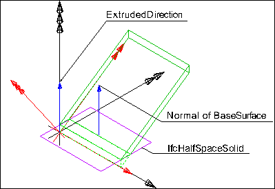
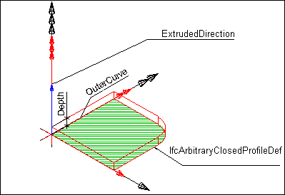
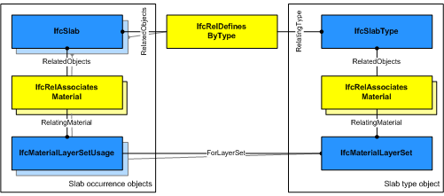

# IfcPlateStandardCase

The standard plate, _IfcPlateStandardCase_, defines a plate with certain constraints for the provision of material usage, parameters and with certain constraints for the geometric representation. The _IfcPlateStandardCase_ handles all cases of plates, that:

* have a reference to the _IfcMaterialLayerSetUsage_ defining the material layers of the plate with thicknesses
* are based on an extrusion of a planar surface as defined by the plate profile
* have a constant thickness along the extrusion direction
* are consistent in using the correct material layer set offset to the base planar surface in regard to the shape representation
* are extruded perpendicular to the plane surface

The definitions of plate openings and niches are the same as given at the supertype _IfcPlate_. The same agreements to the special types of plates, as defined in the _PredefinedType_ attribute apply as well.

> HISTORY  New entity in IFC4.

## Formal Propositions

### HasMaterialLayerSetUsage
A valid instance of _IfcPlateStandardCase_ relies on the provision of an _IfcMaterialLayerSetUsage_.

## Concepts

### Body Clipping Geometry

The following constraints apply to the 'Clipping'
representation:

* Solid: see 'SweptSolid' shape representation,
* Profile: see 'SweptSolid' shape
representation,
* Extrusion: see 'SweptSolid' shape
representation,
* Material: see 'SweptSolid' shape
representation,
* Boolean result: The IfcBooleanClippingResult
shall be supported, allowing for Boolean differences between the
swept solid (here IfcExtrudedAreaSolid) and one or several
IfcHalfSpaceSolid.

 

> EXAMPLE  Figure 252 illustrates a 'Clipping' geometric representation with definition of a plate using advanced geometric representation. The profile is extruded non-perpendicular and the plate body is clipped at the eave.

Figure 252 — Plate body clipping

 

### Body SweptSolid Geometry

The following additional constraints apply to the swept solid
representation:

* Solid: IfcExtrudedAreaSolid is required,
* Profile: IfcArbitraryClosedProfileDef,
IfcRectangleProfileDef, IfcRoundedRectangleProfileDef,
IfcCircleProfileDef, IfcEllipseProfileDef shall be
supported.
* Extrusion: The profile can be extruded perpendicularly
or non-perpendicularly to the plane of the swept profile.
* Material: The definition of the
IfcMaterialLayerSetUsage, particularly of the
OffsetFromReferenceLine and the
ForLayerSet.TotalThickness, has to be consistent to the
'SweptSolid' representation.

 

> EXAMPLE  Figure 251 illustrates a 'SweptSolid' geometric representation. The following interpretation of dimension parameter applies for polygonal plates (in ground floor view): IfcArbitraryClosedProfileDef.OuterCurve being a closed bounded curve is interpreted as area (or foot print) of the plate.

Figure 251 — Plate body extrusion

 

### Material Layer Set Usage

The material of the IfcPlateStandardCase is defined by
IfcMaterialLayerSetUsage and attached by the
IfcRelAssociatesMaterial.RelatingMaterial. It is
accessible by the inverse HasAssociations relationship.
Multi-layer plates can be represented by refering to several
IfcMaterialLayer's within the IfcMaterialLayerSet
that is referenced from the
IfcMaterialLayerSetUsage. 

Material information can also be given at the
IfcPlateType, defining the common attribute data for all
occurrences of the same type. It is then accessible by the
inverse IsDefinedBy relationship pointing to
IfcPlateType.HasAssociations and via
IfcRelAssociatesMaterial.RelatingMaterial.

The IfcPlateStandardCase defines in addition that the
IfcPlateType should have a unique
IfcMaterialLayerSet, that is referenced by
the IfcMaterialLayerSetUsage assigned to all
occurrences of this IfcPlateType.

Figure 250 illustrates assignment of IfcMaterialLayerSetUsage and IfcMaterialLayerSet to the IfcPlateStandardCase as the plate occurrence and to the IfcPlateType. The same IfcMaterialLayerSet shall be shared by many occurrences of IfcMaterialLayerSetUsage. This relationship shall be consistent to the relationship between the IfcPlateType and the IfcPlateStandardCase.

 

Figure 250 — Plate type definition

As shown in Figure 106, the following conventions shall be met:

* The reference coordinate system is the coordinate system established by the IfcExtrudedAreaSolid.Position.
* The reference plane is the plane defined by the extruded profile of IfcExtrudedAreaSolid.SweptSolid. The IfcMaterialLayerSetUsage.OffsetFromReferenceLine is given as a distance from this plane.
* The IfcMaterialLayerSetUsage.DirectionSense defines how the IfcMaterialLayer's are assigned to the reference plane. POSITIVE means in direction to the positive z-axis of the reference coordinate system.
* The IfcMaterialLayerSetUsage.OffsetFromReferenceLine is the distance parallel to the reference plane and always perpendicular to the base (XY) plane of the reference coordinate system. This is independent of a potential non-perpendicular extrusion given by IfcExtrudedAreaSolid.ExtrudedDirection <> 0.,0.,1. A positive value of IfcMaterialLayerSetUsage.OffsetFromReferenceLine would then point into the positive z-axis of the reference coordinate system.
* The Thickness of each IfcMaterialLayer shall be the parallel distance (measured perpendicular to the base plane). The TotalThickness of the IfcMaterialLayerSet is the sum of all layer thicknesses and in case of a perpendicular extrusion identical with IfcExtrudedAreaSolid.Depth
* The IfcMaterialLayerSetUsage.LayerSetDirection i always AXIS3.

Figure 251 — Plate material layers

### Product Placement

The following restriction is imposed:

* The local placement shall provide the location and directions 
for the standard plate, the x/y plane is the plane for the 
profile, and the z-axis is the extrusion axis for the plate body.

