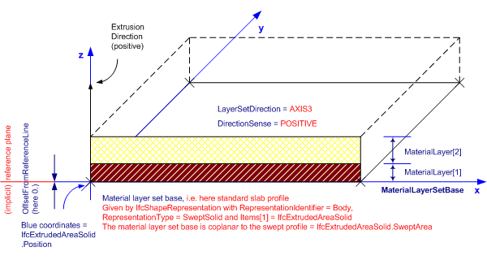

# IfcPlateStandardCase

The standard plate, _IfcPlateStandardCase_, defines a plate with certain constraints for the provision of material usage, parameters and with certain constraints for the geometric representation. The _IfcPlateStandardCase_ handles all cases of plates, that:

* have a reference to the _IfcMaterialLayerSetUsage_ defining the material layers of the plate with thicknesses
* are based on an extrusion of a planar surface as defined by the plate profile
* have a constant thickness along the extrusion direction
* are consistent in using the correct material layer set offset to the base planar surface in regard to the shape representation
* are extruded perpendicular to the plane surface

The definitions of plate openings and niches are the same as given at the supertype _IfcPlate_. The same agreements to the special types of plates, as defined in the _PredefinedType_ attribute apply as well.

> HISTORY  New entity in IFC4.

## Formal Propositions

### HasMaterialLayerSetUsage
A valid instance of _IfcPlateStandardCase_ relies on the provision of an _IfcMaterialLayerSetUsage_.

## Concepts

### Body Clipping Geometry

The following constraints apply to the 'Clipping' representation:

* **Solid**: see 'SweptSolid' shape representation,
* **Profile**:&nbsp;see 'SweptSolid' shape representation,
* **Extrusion**:&nbsp;see 'SweptSolid' shape representation,
* **Material**:&nbsp;see 'SweptSolid' shape representation,
* **Boolean result**: The IfcBooleanClippingResult shall be supported, allowing for Boolean differences between the swept solid (here IfcExtrudedAreaSolid) and one or several IfcHalfSpaceSolid.

&nbsp;

<table>

 <tr>
  <td></td>
  <td><blockquote class="example">EXAMPLE&nbsp; Figure 1 illustrates a 'Clipping' geometric representation with definition of a plate using advanced geometric representation. The profile is extruded non-perpendicular and the plate body is clipped at the eave.</blockquote>

</td>
 </tr>

 <tr>
  <td>
Figure 1 &mdash; Plate body clipping
</td>
  <td>&nbsp;</td>
 </tr>

</table>

### Body SweptSolid Geometry

The following additional constraints apply to the swept solid representation:

* **Solid**: IfcExtrudedAreaSolid is required,
* **Profile**: _IfcArbitraryClosedProfileDef, IfcRectangleProfileDef, IfcRoundedRectangleProfileDef, IfcCircleProfileDef, IfcEllipseProfileDef_ shall be supported.
* **Extrusion**: The profile can be extruded perpendicularly or non-perpendicularly to the plane of the swept profile.
* **Material**: The definition of the IfcMaterialLayerSetUsage, particularly of the OffsetFromReferenceLine and the _ForLayerSet.TotalThickness_, has to be consistent to the 'SweptSolid' representation.

&nbsp;

<table>

 <tr>
  <td></td>
  <td>

<blockquote class="example">EXAMPLE&nbsp; Figure 1 illustrates a 'SweptSolid' geometric representation. The following interpretation of dimension parameter applies for polygonal plates (in ground floor view): <em>IfcArbitraryClosedProfileDef.OuterCurve</em> being a closed bounded curve is interpreted as area (or foot print) of the plate.</blockquote>

 </td>
 </tr>

 <tr>
  <td>
Figure 1 &mdash; Plate body extrusion
</td>
  <td>&nbsp;</td>
 </tr>

</table>

### Material Layer Set Usage

The material of the IfcPlateStandardCase is defined by IfcMaterialLayerSetUsage and attached by the IfcRelAssociatesMaterial.RelatingMaterial. It is accessible by the inverse HasAssociations relationship. Multi-layer plates can be represented by refering to several IfcMaterialLayer's within the IfcMaterialLayerSet that is referenced from the IfcMaterialLayerSetUsage.&nbsp;

Material information can also be given at the IfcPlateType, defining the common attribute data for all occurrences of the same type.&nbsp;It is then accessible by the inverse IsDefinedBy relationship pointing to _IfcPlateType.HasAssociations_ and via _IfcRelAssociatesMaterial.RelatingMaterial_.

The IfcPlateStandardCase defines in addition that the IfcPlateType should have a unique IfcMaterialLayerSet, that is referenced by the&nbsp;IfcMaterialLayerSetUsage assigned to all occurrences of this IfcPlateType.

Figure 1 illustrates assignment of IfcMaterialLayerSetUsage and IfcMaterialLayerSet to the IfcPlateStandardCase as the plate occurrence and to the IfcPlateType. The same IfcMaterialLayerSet shall be shared by many occurrences of IfcMaterialLayerSetUsage. This relationship shall be consistent to the relationship between the IfcPlateType and the IfcPlateStandardCase.

<table border="0" cellpadding="2" cellspacing="2">

<tr><td width="610" align="left" valign="top">

&nbsp;
</td></tr>

<tr><td>
Figure 1 &mdash; Plate type definition
</td></tr>

</table>

As shown in Figure 106, the following conventions shall be met:

* The reference coordinate system is the coordinate system established by the _IfcExtrudedAreaSolid.Position_.
* The reference plane is the plane defined by the extruded profile of _IfcExtrudedAreaSolid.SweptSolid_. The _IfcMaterialLayerSetUsage.OffsetFromReferenceLine_ is given as a distance from this plane.
* The _IfcMaterialLayerSetUsage.DirectionSense_ defines how the IfcMaterialLayer's are assigned to the reference plane. POSITIVE means in direction to the positive z-axis of the reference coordinate system.
* The _IfcMaterialLayerSetUsage.OffsetFromReferenceLine_ is the distance parallel to the reference plane and always perpendicular to the base (XY) plane of the reference coordinate system. This is independent of a potential non-perpendicular extrusion given by _IfcExtrudedAreaSolid.ExtrudedDirection_ &lt;&gt; 0.,0.,1. A positive value of _IfcMaterialLayerSetUsage.OffsetFromReferenceLine_ would then point into the positive z-axis of the reference coordinate system.
* The Thickness of each IfcMaterialLayer shall be the parallel distance (measured perpendicular to the base plane). The TotalThickness of the IfcMaterialLayerSet is the sum of all layer thicknesses and in case of a perpendicular extrusion identical with _IfcExtrudedAreaSolid.Depth_
* The _IfcMaterialLayerSetUsage.LayerSetDirection_ i always AXIS3.

### Product Local Placement

The following restriction is imposed:

* The local placement shall provide the location and directions for the standard plate, the x/y plane is the plane for the profile, and the z-axis is the extrusion axis for the plate body.

