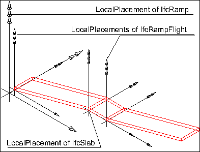

# IfcRamp

A ramp is a vertical passageway which provides a human or vehicle circulation link between one floor level and another floor level at a different elevation. It may include a landing as an intermediate floor slab. A ramp normally does not include steps.

{ .extDef}
> NOTE  Definition according to ISO 6707-1: Inclined way or floor joining two surfaces at different levels.

The _IfcRamp_ shall either be represented:

* as a ramp assembly that aggregates all parts(ramp flight, landing, etc.) with own shape representations, or
* as a single ramp without decomposition including all shape representations directly at the ramp entity.

> NOTE  In case of an _IfcRamp_ being the assembly of all parts of the ramp the aggregation is handled by the _IfcRelAggregates_ relationship, relating an _IfcRamp_ with the related _IfcRampFlight_ and landings, _IfcSlab_ with PredefinedType=LANDING. _IfcRailing_'s belonging to the ramp may also be included into the aggregation.

> NOTE  Model View Definitions and implementer agreements may restrict the _IfcRamp_ being an assembly to not have an independent shape representation, but to always require that the decomposed parts have a shape representation. In this case, at least the 'Body' geometric representations shall not be provided directly at _IfcRamp_ if it is an assembly. The 'Body' geometric representation of the _IfcRamp_ is then the sum of the 'Body' shape representation of the parts within the decomposition structure.

> HISTORY  New entity in IFC2.0.

{ .change-ifc2x4}
> IFC4 CHANGE Attribute _ShapeType_ renamed to _PredefinedType_

## Attributes

### PredefinedType
Predefined generic types for a ramp that are specified in an enumeration. There may be a property set given for the predefined types.
> NOTE  The _PredefinedType_ shall only be used, if no _IfcRampType_ is assigned, providing its own _IfcRampType.PredefinedType_.

{ .change-ifc2x4}
> IFC4 CHANGE The attribute has been renamed from ShapeType and changed to be OPTIONAL with upward compatibility for file based exchange.

## Formal Propositions

### CorrectPredefinedType
Either the _PredefinedType_ attribute is unset (e.g. because an _IfcRampType_ is associated), or the inherited attribute _ObjectType_ shall be provided, if the _PredefinedType_ is set to USERDEFINED.

### CorrectTypeAssigned
Either there is no ramp type object associated, i.e. the _IsTypedBy_ inverse relationship is not provided, or the associated type object has to be of type _IfcRampType_.

## Concepts

### Axis 2D Geometry

The walking line is represented by a two-dimensional open curve
as the axis. The curve is directed into the upward direction
(direction has to be interpreted as specified at the subtypes of
IfcCurve).

> NOTE  The 'Axis' representation of IfcRamp
> may be provided even if the IfcRamp has components with own
>  shape representations.

### Body Clipping Geometry

### Body SweptSolid Geometry

If the IfcRamp has no components defined (empty set of
SELF\IfcProduct.IsDecomposedBy) then the IfcRamp 'Body' geometry
may be represented by an own IfcShapeRepresentation.

### Element Decomposition

If the IfcRamp has components (referenced by
SELF\IfcProduct.IsDecomposedBy) then no independent 'Body'
geometric representation shall be defined for the IfcRamp.
The IfcRamp is then geometrically represented by the
 geometric representation of its components.

 

> EXAMPLE  Figure 253 illustrates IfcRamp defining the local placement for all components.

Figure 253 — Ramp placement

 

### Material Solid

The material of the IfcRamp is defined by the
IfcMaterial and attached by the
IfcRelAssociatesMaterial.RelatingMaterial. It is
accessible by the inverse HasAssociations
relationship.

Material information can also be given at the
IfcRampType, defining the common attribute data for all
occurrences of the same type. It is then accessible by the
inverse IsDefinedBy relationship pointing to
IfcRampType.HasAssociations and via
IfcRelAssociatesMaterial.RelatingMaterial to
IfcMaterial. If both are given, then the material directly
assigned to IfcRamp overrides the material assigned to
IfcRampType.

### Object Typing

### Placement

The following restriction may be imposed by view definitions or implementer agreements:

* If the IfcRamp establishes an aggregate, then
all contained elements shall be placed relative to the
IfcRamp.ObjectPlacement.

### Property Sets for Objects

### Spatial Containment

The IfcRamp, as any subtype of IfcBuildingElement,
may participate alternatively in one of the two different containment relationships:

* the Spatial Containment (defined here), or
* the Element Composition.

