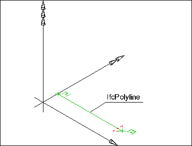
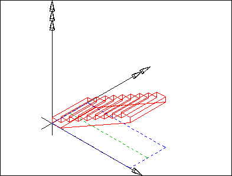
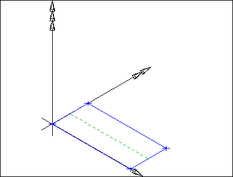

# IfcStairFlight

A stair flight is an assembly of building components in a single "run" of stair steps (not interrupted by a landing). The stair steps and any stringers are included in the stair flight. A winder is also regarded a part of a stair flight.

An _IfcStairFlight_ is normally aggregated by an _IfcStair_ through the _IfcRelAggregates_ relationship, the stair flight is then included in the set of _IfcRelAggregates.RelatedObjects_. An _IfcStairFlight_ normally connects the floor slab of zero to two different storeys (or partial storeys, or landings) within a building. The connection relationship between the _IfcStairFlight_ and the _IfcSlab_ can be expressed using the _IfcRelConnectsElements_ relationship.

> HISTORY  New entity in IFC2.0.

## Attributes

### NumberOfRisers
Number of the risers included in the stair flight
{ .change-ifc2x4}
> IFC4 CHANGE The attribute has been deprecated it shall only be exposed with a NIL value. Use _Pset_StairFlightCommon.NumberOfRisers_ instead.

### NumberOfTreads
Number of treads included in the stair flight.
{ .change-ifc2x4}
> IFC4 CHANGE The attribute has been deprecated it shall only be exposed with a NIL value. Use _Pset_StairFlightCommon.NumberOfTreads_ instead.

### RiserHeight
Vertical distance from tread to tread. The riser height is supposed to be equal for all stairs in a stair flight.
  
{ .change-ifc2x4}
> IFC4 CHANGE The attribute has been deprecated it shall only be exposed with a NIL value. Use _Pset_StairFlightCommon.RiserHeight_ instead.

### TreadLength
Horizontal distance from the front to the back of the tread. The tread length is supposed to be equal for all steps of the stair flight.
  
{ .change-ifc2x4}
> IFC4 CHANGE The attribute has been deprecated it shall only be exposed with a NIL value. Use _Pset_StairFlightCommon.TreadLength_ instead.

### PredefinedType
Predefined generic type for a stair flight that is specified in an enumeration. There may be a property set given specifically for the predefined types.
> NOTE  The _PredefinedType_ shall only be used, if no _IfcStairFlightType_ is assigned, providing its own _IfcStairFlightType.PredefinedType_.

{ .change-ifc2x4}
> IFC4 CHANGE The attribute has been added at the end of the entity definition.

## Formal Propositions

### CorrectPredefinedType
Either the _PredefinedType_ attribute is unset (e.g. because an _IfcStairFlightType_ is associated), or the inherited attribute _ObjectType_ shall be provided, if the _PredefinedType_ is set to USERDEFINED.

### CorrectTypeAssigned
Either there is no stair flight type object associated, i.e. the _IsTypedBy_ inverse relationship is not provided, or the associated type object has to be of type _IfcStairFlightType_.

## Concepts

### Axis 2D Geometry

The walking line is represented by a two-dimensional open 
curve as the axis. The curve is directed into the upward 
direction (direction has to be interpreted as specified at the
 subtypes of IfcCurve). 

Figure 273 illustrates the axis representation which has the following constraints:

* In case of straight flights the curve shall be a single item of type IfcPolyline.
* In case of winding flights the curve shall be a single item of type IfcCompositeCurve.
* In case of a curved flight or a spiral flight the curve shall be a single item of type IfcTrimmedCurve.

Figure 273 — Stair flight axis

### Body SweptSolid Geometry

Figure 275 illustrates the 'Body' geometric representation using a 'SweptSolid' representation type.

Figure 275 — Stair flight body

### Footprint Geometry

The flight foot print, including the flight boundary is 
represented by a two-dimensional geometric curve set.

Figure 274 illustrates the footprint representation which has the following constraints:

* In case of straight flights the curve set shall consists of a single item of type IfcPolyline.
* In case of winding flights or curved flights the curve set shall consists of a single item of type IfcCompositeCurve.
* In case of a spiral flight the curve set shall consists of a single item of type IfcConic or IfcPolyline.

Figure 274 — Stair flight footprint

### Material Solid

The material of the IfcStairFlight is defined by the
IfcMaterial and attached by the
IfcRelAssociatesMaterial.RelatingMaterial. It is
accessible by the inverse HasAssociations
relationship.

### Object Typing

### Property Sets for Objects

### Quantity Sets

### Spatial Containment

The IfcStairFlight, as any subtype of IfcBuildingElement, 
may participate alternatively in one of the two different containment relationships:

* the Spatial Containment (defined here), or
* the Element Composition.

> NOTE  Model view definitions or implementer agreements may force an IfcStairFlight to be solely used as a part within an IfcStair container. In this case, no Spatial containment shall be used.
> 

