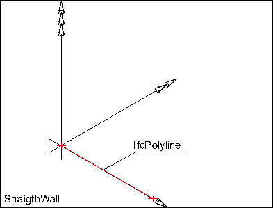
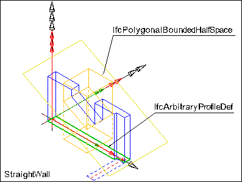
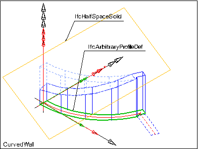
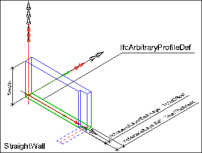
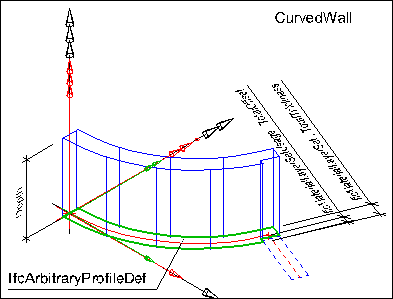
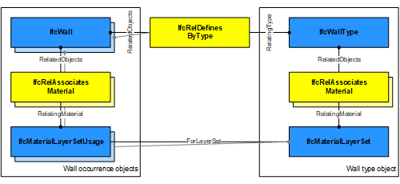

# IfcWall

The wall represents a vertical construction that may bound or subdivide spaces. Wall are usually vertical, or nearly vertical, planar elements, often designed to bear structural loads. A wall is however not required to be load bearing.

{ .extDef}
> NOTE&nbsp; Definition according to ISO 6707-1: vertical construction usually in masonry or in concrete which bounds or subdivides a construction works and fulfils a load bearing or retaining function.

> NOTE&nbsp; There is a representation of walls for structural analysis provided by a proper subtype of _IfcStructuralMember_ being part of the _IfcStructuralAnalysisModel_.

> NOTE&nbsp; An arbitrary planar element to which this semantic information is not applicable (is not predominantly vertical), shall be modeled as _IfcPlate_.

A wall may have openings, such as wall openings, openings used for windows or doors, or niches and recesses. They are defined by an _IfcOpeningElement_ attached to the wall using the inverse relationship _HasOpenings_ pointing to _IfcRelVoidsElement_.

> NOTE&nbsp; Walls with openings that have already been modeled within the enclosing geometry may use the relationship _IfcRelConnectsElements_ to associate the wall with embedded elements such as doors and windows.

There are three entities for wall occurrences:

* _IfcWallStandardCase_  used for all occurrences of walls, that have a non-changing thickness along the wall path and where the thickness parameter can be fully described by a material layer set. These walls are always represented geometrically by an 'Axis' and a 'SweptSolid' shape representation (or by a 'Clipping' geometry based on 'SweptSolid'), if a 3D geometric representation is assigned. In addition they have to have a corresponding _IfcMaterialProfileSetUsage_ assigned.
* _IfcWallElementedCase_ used for occurrences of walls which are aggregated from subordinate elements, following specific decomposition rules expressed by the mandatory use of _IfcRelAggregates_ relationship.
* _IfcWall_  used for all other occurrences of wall, particularly for walls with changing thickness along the wall path (e.g. polygonal walls), or walls with a non-rectangular cross sections (e.g. L-shaped retaining walls), and walls having an extrusion axis that is unequal to the global Z axis of the project (i.e. non-vertical walls), or walls having only 'Brep', or 'SurfaceModel' geometry.

> HISTORY&nbsp; New entity in IFC1.0

## Attributes

### PredefinedType
Predefined generic type for a wall that is specified in an enumeration. There may be a property set given specifically for the predefined types.
> NOTE&nbsp; The _PredefinedType_ shall only be used, if no _IfcWallType_ is assigned, providing its own _IfcWallType.PredefinedType_.

{ .change-ifc2x4}
> IFC4 CHANGE The attribute has been added at the end of the entity definition.

## Formal Propositions

### CorrectPredefinedType
Either the _PredefinedType_ attribute is unset (e.g. because an _IfcWallType_ is associated), or the inherited attribute _ObjectType_ shall be provided, if the _PredefinedType_ is set to USERDEFINED.

### CorrectTypeAssigned
Either there is no wall type object associated, i.e. the _IsTypedBy_ inverse relationship is not provided, or the associated type object has to be of type _IfcWallType_.

## Concepts

### Axis 2D Geometry

The wall axis is represented by a two-dimensional open curve 
within a particular shape representation. The 'Axis' shape representation is only used to locate the 
material layer set along the axis, if the IfcMaterialLayerSetUsgae is applied to the IfcWall. In this case, the wall axis is used to 
apply the material layer set usage parameter to the wall geometry.

* Axis
	+ IfcPolyline having two Points, or 
	IfcTrimmedCurve with BasisCurve of Type
	IfcLine for the 'SweptSolid' provided as 
	IfcExtrudedAreaSolid. The axis curve lies on the x/y plane and is parallel to the x-axis of
	 the object coordinate system.
	+ IfcTrimmedCurve with BasisCurve of Type
	IfcCircle for 'SweptSolid' provided as
	 IfcExtrudedAreaSolid. The axis curve lies on the x/y plane
	 of the object coordinate system, the tangent at the start is along 
	the positive x-axis.

 

> EXAMPLE  Figure 279 illustrates an axis representation for a straight wall. In case of a straight wall, the set of items shall
> include a single geometric representation item of type IfcPolyline or IfcTrimmedCurve with the BasisCurve being an IfcLine. The IfcPolyline or IfcTrimmedCurve shall be parallel (here in a special case co-linear) to the x-axis
> of the object coordinate system. The direction shall be identical to the direction of the x-axis.

Figure 279 — Wall axis straight

 

> EXAMPLE  Figure 280 illustrates an axis representation for a curved wall. In case of a curved wall, the set of items shall include
> a single geometric representation item of type IfcTrimmedCurve. The curve shall have a BasisCurve of type IfcCircle. The tangent of the IfcTrimmedCurve shall be parallel at start to the x-axis of the object coordinate system. The direction shall be identical to the direction of the x-axis.

Figure 280 — Wall axis curved

 

### Body Clipping Geometry

The following additional constraints apply to the 'SweptSolid' 
representation, when an IfcMaterialLayerSetUsage is assigned to the IfcSlab:

* Solid: see standard geometric representation
* Profile: see standard geometric representation
* Extrusion: see standard geometric representation
* Boolean result: The IfcBooleanClippingResult
shall be supported, allowing for Boolean differences between the
swept solid (here IfcExtrudedAreaSolid) and one or several
IfcHalfSpaceSolid (or subtypes).

Figure 283 illustrates a clipping for a straight wall using an IfcPolygonalBoundedHalfSpace as SecondOperand in
 the IfcBooleanClippingResult.

Figure 284 illustrates a clipping for a curved wall using an IfcHalfSpaceSolid as SecondOperand in the
IfcBooleanClippingResult.

Figure 283 — Wall body clipping straight

Figure 284 — Wall body clipping curved

### Body SweptSolid Geometry

The following additional constraints apply to the 'SweptSolid'
representation:

* Solid: IfcExtrudedAreaSolid is required,
* Profile: IfcArbitraryClosedProfileDef is
required.
* Extrusion: All extrusion directions shall be 
supported.

The following additional constraints apply to the 'SweptSolid' 
representation, when an IfcMaterialLayerSetUsage is assigned to the IfcSlab:

* Solid: IfcExtrudedAreaSolid is required,
* Profile: IfcArbitraryClosedProfileDef and
IfcRectangleProfileDef shall be supported.
* Extrusion: The profile shall be extruded vertically,
i.e., in the direction of the z-axis of the co-ordinate system of
the referred spatial structure element. It might be further
constraint to be in the direction of the global z-axis in
implementers agreements. The extrusion axis shall be perpendicular
to the swept profile, i.e. pointing into the direction of the
z-axis of the Position of the IfcExtrudedAreaSolid.

The profile of a wall is described in the ground view and extruded vertically. The profile (also identical with the foot print of the wall) is defined by the IfcArbitraryClosedProfileDef (excluding its subtypes). The profile is given with all wall connections already resolved.

Figure 281 illustrates a body representation for a straight wall. In case of a straight wall, the two sides of the profile shall be parallel to the wall axis, that is, the wall has a single unchanged thickness.

Figure 282 illustrates a body representation for a curved wall. In case of a curved wall, the two sides of the profile shall be parallel (with defined offset) to the wall axis, that is, the wall has a single unchanged thickness.

Figure 281 — Wall body extrusion straight

Figure 282 — Wall body extrusion curved

### Material Layer Set

The material information of the IfcWall is defined by
 IfcMaterialLayerSet, or as fallback by IfcMaterial, and it is attached either directly or at the IfcWallType. In this case, the material information does not allow to construct a shape by applying the layer definition to the axis representation, to enable this parametric definition, the IfcMaterialLayerSetUsage has to be used instead.

### Material Layer Set Usage

The material of IfcWall can be defined by 
IfcMaterialLayerSetUsage and attached by 
IfcRelAssociatesMaterial.RelatingMaterial. It is
 accessible by the inverse HasAssociations relationship.
 Multi-layer walls can be represented by referring to several 
IfcMaterialLayer's within the IfcMaterialLayerSet 
that is referenced from the
 IfcMaterialLayerSetUsage.

When assigning an 
IfcMaterialLayerSetUsage to IfcWall it shall imply that the
 IfcWallType should have a unique
 IfcMaterialLayerSet, that is referenced by IfcMaterialLayerSetUsage assigned to all 
occurrences of this IfcWallType.

Figure 277 — Wall Standard Object Typing

> EXAMPLE  Figure 277 illustrates assignment of IfcMaterialLayerSetUsage and IfcMaterialLayerSet to the wall type and the wall occurrence.

Figure 278 illustrates material layer usage, where the following conventions shall be met:

* The reference coordinate system is the local coordinate system established by the ObjectPlacement of the IfcWallStandardCase.
* The reference axis is the axis defined by the IfcShapeRepresentation with RepresentationType='Axis' as one of the
Representation.Representations of the IfcWallStandardCase.
* The IfcMaterialLayerSetUsage.OffsetFromReferenceLine is given as a distance from this axis.
* The IfcMaterialLayerSetUsage.OffsetFromReferenceLine is the distance parallel to the reference axis and always within the base
(XY) plane of the reference coordinate system. A positive value of IfcMaterialLayerSetUsage.OffsetFromReferenceLine would
then point into the positive y-axis of the reference coordinate system.
* The IfcMaterialLayerSetUsage.DirectionSense defines how the IfcMaterialLayer's are assigned to the reference axis. POSITIVE means in direction to the positive y-axis of the reference coordinate system.
* The Thickness of each IfcMaterialLayer is provided starting from the OffsetFromReferenceLine and in the direction given by DirectionSense. It is applied without any gap or overlap between two consecutive layers. The TotalThickness of the IfcMaterialLayerSet is the sum of all layer thicknesses.
* The IfcMaterialLayerSetUsage.LayerSetDirection is always AXIS2.

Figure 278 — Wall material layers

### Object Typing

### Path Connectivity

### Property Sets for Objects

### Quantity Sets

### Spatial Containment

The IfcWall, as any subtype of IfcBuildingElement, 
may participate alternatively in one of the two different containment relationships:

* the Spatial Containment (defined here), or
* the Element Composition.

### Surface Geometry

> NOTE  The 'Surface' can be used to define a
> surfacic model of the building (e.g. for analytical purposes, or
> for reduced Level of Detail representation).

